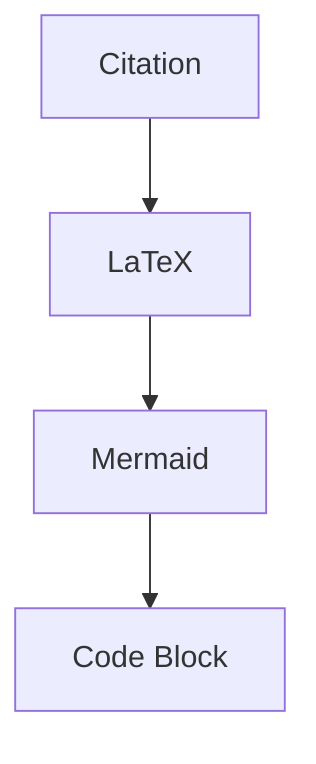

这是一页内部验收 fixture，用来确认论文式引用和已有 Markdown 能力可以同页共存。单引用应该显示为右上角编号[@nash1950]，多引用应该显示为连续的右上角编号[@nash1950; @riehl2017]。

带 locator 的引用不应该被误判为逗号多引用[@nash1950, p. 12]，suppress author 也应该正常进入 bibliography[-@riehl2017]。

行内公式要继续能渲染，例如 $ x $ 和 $E = mc^2$。块级公式也要稳定：

$$
\int_0^1 x^2 dx = \frac{1}{3}
$$



下面这个代码块里的 `[@literal]` 必须保持字面量，不参与 citation 校验。

```text
Literal citation marker: [@literal]
Literal bare marker: @literal
```

## 参考文献

[^ref]
