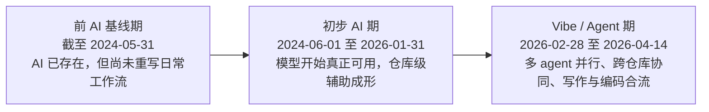
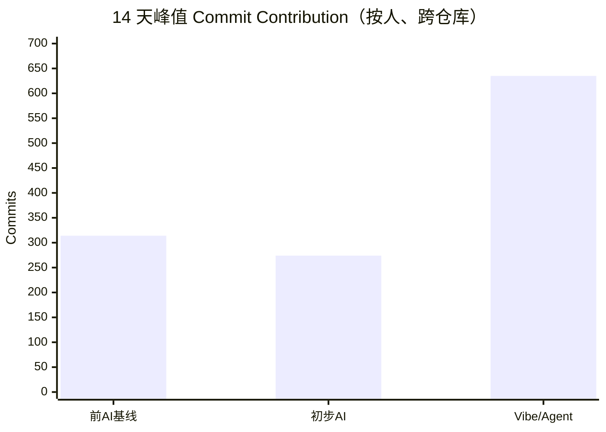
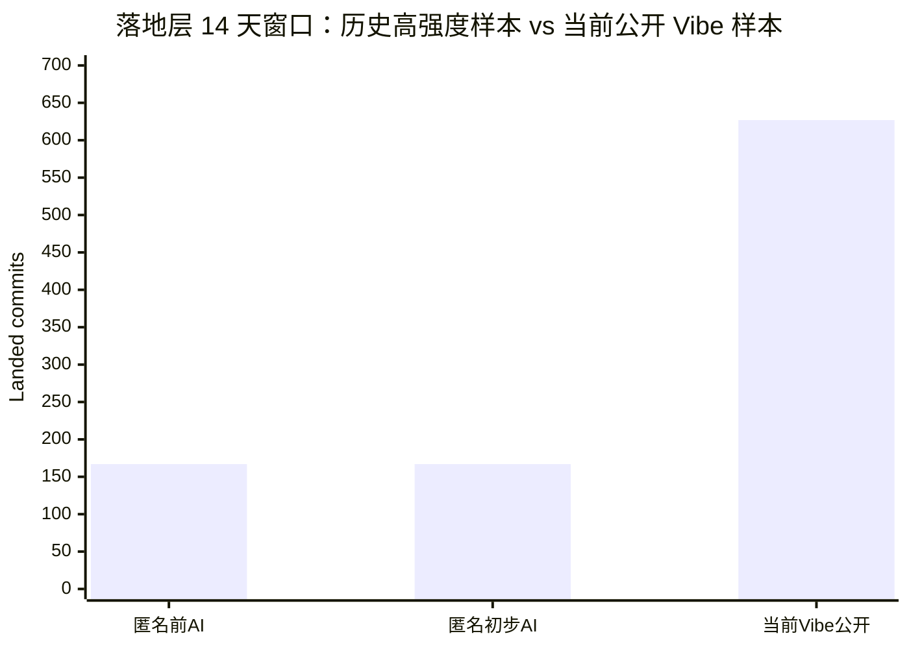
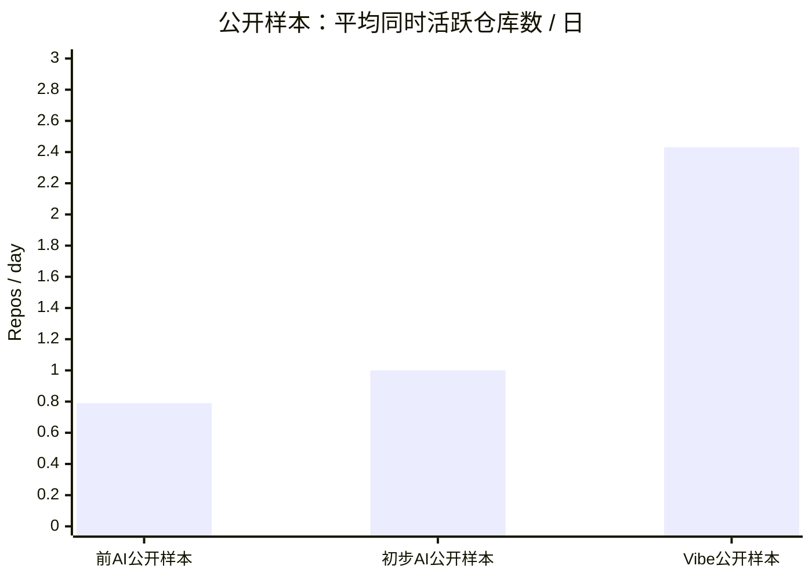

最近这段时间，笔者越来越强烈地意识到一件事：如果今天还把 AI 工具理解成 IDE 角落里那个偶尔帮你补全两行代码的小玩意，那基本已经落后现实半个时代了。真正把工作方式掀翻的，并不是“它会不会写一段函数”，而是模型、agent、仓库级搜索、终端执行、上下文压缩和多任务并行这些东西一旦拧成一股绳，人面对的工作单元就彻底变了。过去你面对的是一个 repo、一段代码、一个 issue；现在你面对的往往是一整条战线、一排同时推进的任务，以及一群等着你继续喂上下文、做判断、定边界的 agent。

这件事如果只靠感觉讲，很容易写成两种都不太中用的文章。要么是“AI 真香”“效率起飞”这种一听就知道没什么统计底座的口号文；要么是“工具无罪”“拥抱变化”“保持理性”这种句句正确、读完却像没读的行业播报。前者太浮，后者太轻。说白了，很多文章之所以没有说服力，不是因为它们说错了，而是因为它们把一个已经剧烈改写现实的东西，写得像一段温吞吞的新闻摘要。

所以这次，笔者不打算顺着那条路写。我确实去翻了自己的 GitHub 记录，也确实做了统计。公开部分只用 `HansBug` 这边已经开放的信息做详细表格、详细链接和细粒度拆解；另一部分未开源工作，则只保留匿名聚合结果，不挂仓库名，不挂链接，也不写任何可以逆推出具体项目的细节。该公开的地方公开到底，不该公开的地方到此为止，这不是姿态问题，而是边界问题。

还有一点也必须先说清楚：这篇文章的主体分析，按“人”做，不按“单个 repo”做。原因很简单，vibe/agent 时代真正离谱的地方，本来就不是某一个仓库一天多了多少 commit，而是同一个人在同一个时间窗里，能不能同时把代码、文档、研究笔记、博客长文、脚手架、站点本身一起挂起来推进。如果今天还用单仓库视角理解这种产能，那个坐标系从一开始就是歪的。

不过在看数字之前，有两件事必须先钉死：分期坐标系和统计口径。前者不钉死，后面很容易在时间边界上吵成一锅；后者不钉死，后面那些看起来很漂亮的倍数，很可能只是把自己先哄舒服了而已。

## 写在前面：先把这篇文章的坐标系钉住

### 分期：这三个时代到底怎么切

这组原始分期设定里有一个很现实的问题：“前 AI 时代”写的是 `2024 年 6 月之前`，“初步 AI 时代”写的是 `2024 年 1 月到 2026 年 1 月底`。这两个区间在 `2024-01-01` 到 `2024-05-31` 之间明显重叠。写文章的时候可以含糊，做统计的时候不能含糊；否则同一段时间会被重复计入，后面无论算 commit 数、活跃仓库数还是产能倍数，最后都会变成坐标系先坏掉、结论再跟着坏掉。

因此，本文采用不重叠的精确分期：

| 时期 | 精确时间范围 | 为什么这么切 |
| --- | --- | --- |
| 前 AI 基线期 | `截至 2024-05-31` | 把 `2024-05-13` 的 GPT-4o 和 `2024` 年中之后更成熟的代码助手浪潮之前的部分，视为“AI 已存在，但尚未重写日常工作流”的基线期。 |
| 初步 AI 期 | `2024-06-01` 到 `2026-01-31` | 这段时间里，模型开始真正可用，仓库级辅助开始成形，AI 从“能玩”变成“能干活”；但多 agent 编排和大规模 vibe 工作流还没有在笔者这里完全爆开。 |
| Vibe / Agent 期 | `2026-02-28` 到 `2026-04-14` | 这里的 `2026-02-28` 是本文统计采用的个人工作流分界点，不是术语诞生日。所谓 `vibe coding` 一词通常追溯到 `2025-02-02` 的公开表述，但术语出生和个人工作方式真正被改写，本来就不是一回事[@vibe-coding-origin]。 |

这张图是本文采用的切法：

之所以敢这么切，不是因为我想在文里玩概念，而是因为公开时间线已经很清楚。`OpenAI` 在 `2024-05-13` 推出 `GPT-4o`，把速度、成本和交互能力一起往前推了一截[@openai-gpt4o]；`Anthropic` 在 `2025-02-24` 推出 `Claude Sonnet 3.7`，后续又持续推进更强的编码模型和 `Claude Code` 形态[@anthropic-api-notes; @anthropic-claude-code]；`OpenAI` 则在 `2025-05-16` 公布 `Codex` 研究预览，并在 `2025-10-06` 宣布 `Codex` GA[@openai-codex-preview; @openai-codex-ga]。再结合 `SWE-bench`、软件工程 agents 综述以及 `2026 Agentic Coding Trends Report` 这些公开资料看，行业讨论的对象早就不只是“补全”了，而是 repo-scale reasoning、tool use、issue resolution 和 workflow orchestration 这些更大的工作单元[@swe-bench; @se-agent-survey; @anthropic-agentic-report; @genai-reshaping-dev]。

换句话说，这三个阶段之间真正的差别，根本不在于“有没有模型”，而在于模型被接进了多大尺度的工作单元。前面是 AI 已经存在，但还没真正改写工作结构；中间是 AI 开始真正能打，单条主线被明显加速；到了现在，AI 则开始像一整排部将一样被接进日常工作流。术语当然重要，但比术语更重要的，是你的工作方式到底什么时候真的被它改写。

### 方法：本文到底统计什么，不统计什么

这次统计我用了两层口径。第一层是 GitHub `contributionsCollection` 里的 `commit contribution`，它回答的是“在一个连续时间窗里，作为这个人，我总共发生了多少次跨仓库的有效提交活动”。这一层最适合做峰值窗口筛选，因为它天然按“人”而不是按某个仓库在看。第二层是 GitHub 默认分支 landed commit 对应的落地层指标，包括 landed commit、非 merge commit、修改文件数、增删行，以及提交更偏代码还是更偏文档。它回答的是另一个问题：这些高强度窗口最后到底在工程表面上落成了什么。

两层都要用，原因并不复杂。只看贡献层，就只能知道“很忙”，却不知道忙出来的是代码、文档、测试还是一堆杂项；只看落地层，又很容易被默认分支策略、merge 方式、批量 sweep、大型导入和 API 技术细节带偏。尤其是今天这种多 agent、多分支、多仓库同时推进的工作流，如果只盯 landed commit，很多实际上已经发生过的密集劳动会被压扁；但如果只盯 contribution，又会把产物结构抹平。所以本文的做法是先用贡献层找峰值窗口，再用落地层拆细节，最后把两者放在一起看。

“按人统计”这件事也不是姿态，而是现实要求。前 AI 时代的高强度输出，往往是一个主 repo 带一两个配套仓库；现在的高强度输出，往往同时挂着研究笔记、框架代码、博客站点、文档沉淀、技能脚手架和若干调研仓库。如果今天还按单 repo 统计，得到的最多只是“这个库最近很热闹”，而不是“这个人当前到底处在什么工作状态里”。说得更直一点，那就像拿单兵冲锋速度去衡量一个师级指挥调度水平，当然也能测，但测出来的根本不是重点。

另外，本文专门处理了那些明显“脚本味过重”的样本。GitHub 上有些仓库一看名字、一看提交结构，就知道更像镜像、同步、机械回填、数据导入或者自动更新。它们当然不是没价值，但如果把这种窗口直接拿来代表“人类高强度思维劳动”，那结论会走样。所以这次的做法是：先在人级贡献层里找峰值，再人工排掉那些更像镜像/同步/机械回填的候选窗口，优先保留更能体现“人写的、人在判断的”那部分样本。

数据边界也一并说清楚，省得后面又跑偏：

1. 公开细表和外链，只使用 `HansBug` 这边已经公开的信息。
2. 另一部分未开源工作，确实做了统计，但只给匿名聚合结果，不挂仓库名，不挂链接，也不写任何可逆去匿名的细节。
3. 全文时间统计的截止时间，是 **2026-04-14**。
4. 行数、文件数只作为辅助证据，不作为 headline KPI，因为大规模批量更新、资源导入以及 GitHub Commit API 的 `300 files` 返回上限，都会让这类数字在某些窗口里显著变形。

这一步看上去有点像先把话说死，实际上非常必要。因为如果方法论不先钉住，后面的数字很容易沦为一种很省事、也很廉价的自我催眠：先拿几个漂亮数把自己哄舒服，再假装那就是分析。坦白说，这种活 AI 比人还会干，但也正因为如此，人更得把坐标系先守住。

## 公开样本与匿名样本：三段高强度窗口到底差在哪里

### 公开样本：`HansBug` 这边能完全复核的三段窗口

先看公开样本。这里的窗口，都是按“人”的维度，在对应时期里挑出的 14 天高强度窗口；表里给出的公开仓库链接，都可以直接点进去核对。

#### 表 1：公开样本的 14 天峰值窗口（贡献层，按人、跨仓库）

| 时期 | 时间窗 | 14 天 `commit contribution` | 活跃天数 | 日均贡献提交 | 平均活跃仓库数/日 | 峰值同时活跃仓库数 | 主要公开仓库 |
| --- | --- | ---: | ---: | ---: | ---: | ---: | --- |
| 前 AI 基线期 | `2023-02-22` ~ `2023-03-07` | 117 | 8 | 8.36 | 0.79 | 2 | [opendilab/treevalue](https://github.com/opendilab/treevalue) 101、[HansBug/hbutils](https://github.com/HansBug/hbutils) 9、[HansBug/fake_html](https://github.com/HansBug/fake_html) 7 |
| 初步 AI 期 | `2025-06-13` ~ `2025-06-26` | 264 | 12 | 18.86 | 1.00 | 2 | [HansBug/pyfcstm](https://github.com/HansBug/pyfcstm) 234、[HansBug/plantumlcli](https://github.com/HansBug/plantumlcli) 30 |
| Vibe / Agent 期 | `2026-04-01` ~ `2026-04-14` | 635 | 14 | 45.36 | 2.43 | 4 | [HansBug/research_ideas](https://github.com/HansBug/research_ideas) 328、[HansBug/hubvault](https://github.com/HansBug/hubvault) 139、[HansBug/HansBug.github.io](https://github.com/HansBug/HansBug.github.io) 102、[HansBug/pyfcstm](https://github.com/HansBug/pyfcstm) 46、[HansBug/python-ai-cheatsheet](https://github.com/HansBug/python-ai-cheatsheet) 11、[HansBug/deck-workflow-skill](https://github.com/HansBug/deck-workflow-skill) 7、[HansBug/jml-openjml-field-guide](https://github.com/HansBug/jml-openjml-field-guide) 2 |

光看这张表，其实已经能看出三个时代的结构差异。前 AI 基线期更像“一条主线加两个边角补位”：主体是 `treevalue` 的维护与修正，旁边挂着 `hbutils` 和 `fake_html`。初步 AI 期则是“单主线高速推进”：主战场几乎全部集中在 `pyfcstm`，旁边带一个 `plantumlcli`。到了 `2026-04-01` 到 `2026-04-14` 这个窗口，画风就完全不一样了，研究写作、存储框架、博客站点、DSL/框架推进、速查手册、技能脚手架和调研导览全都在同一时间窗里出现了。它已经不是“一个项目写得很快”，而是同一个人同时挂起了多种性质完全不同的输出面。

更重要的是，这种变化不是简单的“多开几个仓库窗口”。平均活跃公开仓库数从前 AI 公开窗口的 `0.79`，涨到当前公开窗口的 `2.43`；峰值同时活跃公开仓库数从 `2` 变成 `4`。前者意味着你日常就在多条线上持续切换，后者意味着在最忙的时候，公共可见层面的工作并行度已经是过去的两倍。这个差异并不是装饰项，它本身就是工作方式已经被改写的证据。

#### 表 2：公开样本的 14 天峰值窗口（落地层，默认分支 landed commit）

| 时期 | 时间窗 | landed commit | 非 merge commit | 覆盖仓库数 | 修改文件数 | `+` 行 | `-` 行 | 涉及代码提交数 | 涉及文档提交数 |
| --- | --- | ---: | ---: | ---: | ---: | ---: | ---: | ---: | ---: |
| 前 AI 基线期 | `2023-02-22` ~ `2023-03-07` | 60 | 46 | 3 | 256 | 7,580 | 384 | 50 | 22 |
| 初步 AI 期 | `2025-06-13` ~ `2025-06-26` | 174 | 174 | 2 | 537 | 34,142 | 13,283 | 146 | 25 |
| Vibe / Agent 期 | `2026-04-01` ~ `2026-04-14` | 627 | 611 | 7 | 12,158 | 5,727,977 | 149,172 | 158 | 541 |

落地层比贡献层看起来夸张得多，是因为它更容易把今天这种批量 sweep、跨仓库联动和文档铺开都一起显出来。但也正因为如此，这张表更适合说明“工作面与落地面发生了什么”，而不适合被简单拿来喊一句“我比过去强了十倍”。行数尤其如此，后面我还会专门泼一盆冷水。

真正值得注意的是最后两列。当前公开 Vibe 窗口里，代码相关提交是 `158`，文档相关提交却到了 `541`。这说明今天真正爆炸的，根本不只是“写代码更多了”，而是过去那些没空写、懒得写、来不及写、写起来很折磨人的文档、研究笔记、博客正文、站点内容和知识组织面，全都被重新拉回了主流程。很多人谈 AI coding 时只盯代码，这其实已经是老坐标系了；从我自己的窗口看，AI 更离谱的一刀，恰恰是把写作和代码一起拖进了日常高强度生产流。

### 匿名样本：那部分未开源工作不该被省略

如果只看公开样本，这篇文章很容易被理解成“拿现在公开窗口去欺负一个历史上比较窄的基线”。可事实不是这样。笔者在前 AI 和初步 AI 阶段，本来就不是低产的人，那部分没有开源的工作如果完全省略，反而会把历史强度压得过低。所以这里必须把匿名聚合结果摆出来，边界守住，但历史强度也不能被抹平。

#### 表 3：匿名未开源样本的 14 天高强度窗口（落地层，匿名聚合）

| 匿名样本 | 时间窗 | landed commit | 非 merge commit | 覆盖仓库数 | 活跃天数 | 平均活跃仓库数/日 | 峰值同时活跃仓库数 | 修改文件数 | `+` 行 | `-` 行 |
| --- | --- | ---: | ---: | ---: | ---: | ---: | ---: | ---: | ---: | ---: |
| 匿名前 AI 高强度窗口 | `2023-12-23` ~ `2024-01-05` | 167 | 140 | 8 | 14 | 2.86 | 4 | 1,391 | 51,535 | 5,175 |
| 匿名初步 AI 高强度窗口 | `2024-08-27` ~ `2024-09-09` | 167 | 157 | 6 | 14 | 1.57 | 3 | 644 | 20,560 | 1,461 |

这张表至少说明了两件事。第一，今天的比较不是拿一个很松垮、很温吞的历史自己来烘托现在；相反，历史样本本身就是高压、多仓库并行的样本。第二，也正因为基线不软，当前 `2026-04-01` 到 `2026-04-14` 的公开窗口才显得格外不讲道理：哪怕把匿名历史强度算进去，今天的 landed commit 仍然是 `627 / 167 = 3.75 倍`，非 merge 提交则分别达到 `611 / 140 = 4.36 倍` 与 `611 / 157 = 3.89 倍`。这就不是“我主观上感觉 AI 很猛”了，而是连坐标轴都换了。

#### 表 4：匿名历史样本与当前公开样本的“代码/文档触达面”对比

| 样本 | 涉及代码提交数 | 涉及文档提交数 | 观察 |
| --- | ---: | ---: | --- |
| 匿名前 AI 高强度窗口 | 132 | 69 | 编码密度高，文档并不少，但仍是“代码主、文档辅” |
| 匿名初步 AI 高强度窗口 | 160 | 25 | 更典型的“代码主线窗口”，文档面明显收缩 |
| 当前公开 Vibe 窗口 | 158 | 541 | 代码触达面几乎维持历史峰值，但文档触达面直接爆炸 |

这张表很关键，因为它直接把“AI 只是让代码写得更快”这个常见直觉拆掉了。当前公开窗口里的代码触达提交数，相对于匿名历史高强度样本并没有出现那种夸张到十倍八倍的差距；相反，它相对匿名前 AI 窗口只是 `1.20 倍`，对匿名初步 AI 窗口几乎就是持平。真正爆炸的，是文档和写作面的覆盖：当前公开窗口的文档触达提交数，是匿名前 AI 高强度窗口的 `7.84 倍`，是匿名初步 AI 窗口的 `21.64 倍`。这说明 AI 最离谱的地方，不是让单条代码生产线转得更快，而是让代码、文档、研究笔记、博客长文和知识组织这些过去经常互相挤占时间的东西，开始在同一段高强度工作里一起发生。

## 把“感觉离谱”翻成数字：当前产能到底放大了多少

### 表 5：按人、跨仓库的峰值窗口倍率（贡献层，保守口径）

| 时间窗 | 前 AI 基线期 | 初步 AI 期 | Vibe / Agent 期 | `Vibe / 前AI` | `Vibe / 初步AI` |
| --- | ---: | ---: | ---: | ---: | ---: |
| 7 天峰值 | 193 | 184 | 395 | 2.05x | 2.15x |
| 14 天峰值 | 314 | 274 | 635 | 2.02x | 2.32x |
| 30 天峰值 | 580 | 459 | 996 | 1.72x | 2.17x |

这张表用的是最保守的口径，也就是 contribution-layer 的按人峰值窗口。它的好处恰恰在于不那么炸。可以看到，当前 Vibe / Agent 期的增幅非常扎实，但并没有夸张到像神话故事：它大体稳定落在 `1.7` 到 `2.3` 倍之间。这个结果很重要，因为它提醒我们不要为了证明 AI 很强，就专门去挑最激进、最容易膨胀的指标。如果用最克制的口径看，当前按人、跨仓库的高强度窗口依然是历史高强度窗口的两倍上下，这个数字本身已经足够说明问题，而且相对稳。

下面这张图把三个时期的人级 14 天峰值窗口直接放到一起看：

这三个数之所以不是表 1 里的 `117 / 264 / 635`，原因前面已经交代过了：表 1 展开的是公开可复核窗口，而这张图和表 5 用的是按人视角的人级峰值窗口，因此把匿名未开源样本也纳入了比较。公开样本负责把事情说实，匿名样本负责不让历史强度被低估；这两层必须一起看，否则不是低估历史，就是抹平当下。

### 表 6：公开与匿名样本的落地层倍率（更贴近“干成了多少事”）

| 对比口径 | 基线窗口 | 当前 Vibe 公开窗口 | 倍率 |
| --- | --- | ---: | ---: |
| 公开 landed commit | 前 AI 公开窗口 60 | 627 | 10.45x |
| 公开 landed commit | 初步 AI 公开窗口 174 | 627 | 3.60x |
| 公开非 merge commit | 前 AI 公开窗口 46 | 611 | 13.28x |
| 公开非 merge commit | 初步 AI 公开窗口 174 | 611 | 3.51x |
| 匿名 landed commit | 匿名前 AI 高强度窗口 167 | 627 | 3.75x |
| 匿名 landed commit | 匿名初步 AI 高强度窗口 167 | 627 | 3.75x |
| 匿名非 merge commit | 匿名前 AI 高强度窗口 140 | 611 | 4.36x |
| 匿名非 merge commit | 匿名初步 AI 高强度窗口 157 | 611 | 3.89x |

如果说表 5 说明的是“总体强度确实翻倍了”，那么这张表说明的就是：当工作流真正进入多 agent、多仓库、多输出面的状态以后，最终落到默认分支上的那些东西，已经是过去高强度窗口的 `3` 到 `4` 倍，某些公开对比甚至能到 `10` 倍以上。笔者没有直接把 `10.45x` 当 headline 写在开头，是因为那样虽然很炸，但不够稳。公开前 AI 窗口本身更窄，结构也更集中，如果只拿它当唯一基线，很容易显得像是在挑软柿子捏。

所以更稳妥的 headline 应该是三句话一起看。第一，用 contribution-layer 看，当前人级峰值窗口大致是历史高强度窗口的两倍左右；第二，用 landed-layer 看，当前公开窗口相对于历史匿名高强度窗口，已经是 `3.75` 到 `4.36` 倍；第三，真正“离谱”的地方不是代码单项，而是代码和写作一起被推到了高并行状态。把这三句话拆开讲都不完整，合在一起才是比较稳的结论。

下面这张图把 landed-layer 里最能说明问题的一组对比单独画出来：

如果非要把这段统计压缩成一句俗一点、但并不失真的话，那就是：AI 真正厉害的地方，不是给你省几次敲键盘，而是把你原来要分三周、分三条线、分三种心境才能做完的东西，硬生生压进了同一个 14 天窗口里。所谓“感觉离谱”，本质上就是这种时间压缩和工作面并行叠出来的结果。

## AI 对写作和代码的真实作用：不是单任务更快，而是总工作面被改写

### 为什么我说最大的变化是总工作面暴涨

很多人本能地把 AI 的价值理解成“原来一天写 500 行代码，现在一天写 1000 行”“原来三小时做完一件事，现在一小时做完”。这些理解都不能说错，但它们还停留在旧坐标系里，也就是默认你仍然在沿着单任务、单主线、单仓库那套方式工作。可从这次统计能看出来，今天的现实越来越像是：代码在推进，文档在跟，研究笔记在沉淀，博客长文在收束，站点能力也在一起迭代，而这些东西不再是排队发生，而是并行发生。

公开 Vibe 窗口里，平均活跃公开仓库数已经达到 `2.43 个/日`，峰值同时活跃公开仓库数达到 `4`。对应的前 AI 公开窗口分别只有 `0.79` 和 `2`，初步 AI 公开窗口则是 `1.00` 和 `2`。换句话说，公开可见层面上，今天的工作并行度已经是过去的 `2` 到 `3` 倍。这个指标之所以比“写了多少行代码”更值钱，是因为它直接揭示了大脑被迫盯着多少条轨道，而不是某一条轨道跑得多快。

所以笔者才会反复强调，今天 AI 真正厉害的地方，不是让一个人“更像程序员”，而是让一个人越来越像一个在多条任务线上持续调度的系统管理员、技术主编、架构裁判和小型指挥官。如果还只盯着某一个 repo 最近有没有爆 commit，那等于只看见了战线上的一个碉堡，却没看见整张沙盘已经在同时转起来。

### 说回写作：AI 为什么把文档面和博客面也一起点燃

前面最容易被忽略、但又最不该忽略的数字，其实是当前公开窗口里那 `541` 个文档相关提交。它说明的并不是“今天我突然爱写东西了”，而是写作本身已经被重新拉回了工程主流程。过去很多本来应该写下来的东西最后没写，不是因为人不知道该写，而是因为没空、太费劲、太打断心流，或者资料明明在脑子里，但要把它们整理成一篇能读、能用、能沉淀的文本，成本高得离谱。结果就是，大量本来应该成为知识资产的经验，最后都烂在聊天记录、issue 评论、半截草稿和脑补里。

AI 在这里最狠的一刀，不是替你“写得更漂亮”，而是把知识外化这件事的门槛砍下来了。于是研究笔记更容易先铺开再回收，调研综述更容易先成形再收束，博客长文不再必须等一整块空档才能开写，项目路线、知识图谱、字段说明、站点内容和文档摘要也开始更像日常维护，而不是“以后有空再补”的边角料。换句话说，过去你经常得在“先写代码还是先写下来”之间二选一；现在越来越多的时候，代码、文档、博客和站点可以互相供血，这才是写作面被点燃的真正原因。

这也是为什么，笔者今天会毫不犹豫地把 AI 用在博客和写作上。不是因为它能替我当作者，而是因为在今天，不把 AI 用在写作上，本身反而是在浪费一种极其宝贵的知识外化能力。写作不再只是“我有余力时才去做的表达性活动”，而越来越像工程工作本身的一部分：它负责把判断、经验、结构和路线正式固化下来。如果今天还把它当作附庸，反而是在主动放弃 AI 最能帮人补上的那一块短板。

### 说回代码：AI coding 真正离谱在什么地方

再把视角收回代码本身。笔者觉得，今天 AI coding 的离谱之处至少有四层，而且越往后越关键。

1. 第一层当然是大家都知道的那层：样板、胶水、搬运、格式调整、常规重构、路径搜索、简单脚手架、重复测试和局部改名，这些低价值实现动作现在已经大量可以外包给模型或 agent。这一层是地板，不是天花板。
2. 第二层是它显著降低了多仓库切换的心理成本。以前人在多仓库切换时，最大的损耗往往不是“不会写”，而是重新进上下文、重新找入口、重新恢复工作记忆。今天有了 repo-aware 搜索、上下文压缩、agent 摘要和批量 diff 解释之后，多仓库切换虽然依旧很累，但已经不再像过去那样“每切一次都像重新投胎”。
3. 第三层是它把很多原本需要“整块空档”的任务，打碎成了可以穿插推进的任务。长文、全局重命名、统一接口、补文档、补说明、整理测试、批量 sweep，这些以前经常得等“专门抽一段时间”才能动手的事情，现在越来越能被拆成多条副线，穿插进主任务之间去推进。
4. 第四层，也是我真正觉得最离谱的一层，是它让“架构意图”和“工程表面”之间的距离明显缩短了。过去人脑子里常常已经有一个相对完整的想法，但从想法到真正落成一组工程改动，中间隔着大量机械展开、重复同步和局部细节照顾。现在这层摩擦被削掉了很多，于是人的主要精力就自然前移到了更值钱的地方：这个抽象是否成立，这条路线是否合理，这个边界会不会害人，这件事到底该不该做，而不是只是“怎么亲手把它全部敲出来”。

所以我才会说，AI coding 真正可怕的地方，不是它替你写了多少行，而是它把“想法通往工程表面”的通路变宽了。一旦这条通路变宽，很多过去本来有价值、但总是被实现摩擦磨死的东西，今天就会被捞出来真正做掉。那种感觉，才是今天所谓 AI coding “离谱”的根子。

顺便也在这里泼一盆冷水：不要拿“行数”当最终 KPI。当前公开 Vibe 窗口里的行数看起来极其夸张，甚至已经到了肉眼可见不正常的程度；`research_ideas` 和 `HansBug.github.io` 里都出现过接近或达到 GitHub Commit API `300 files` 返回上限的大提交。这说明今天的工作流确实已经能支撑大规模 sweep 式更新，但它同样说明，如果你把行数直接当 headline KPI，那就非常容易自欺欺人。行数能说明今天的工作表面很大、批量更新很常见、AI 确实把很多大面动作变得可行，但它不能单独说明人的价值提升了多少。人的价值不在行数里，而在判断里；这点要是丢了，这篇文章就会迅速滑进一种非常廉价的产能崇拜。

## 效率、疲惫与责任：人被从战壕里赶出来之后

### 为什么效率更高，人反而更累

很多外行看到这里，第一反应往往是：既然效率提高了这么多，那你岂不是应该轻松很多？不好意思，恰恰相反。AI 越能干，人在很多时候反而越累，而且这件事一点都不神秘。过去大量时间其实消耗在低密度劳动上：机械搬运、重复改名、样板代码、文档格式整理、低级试错、需要耐心但不太需要判断的重复操作。这些活以前都得自己做，不一定难，但很碎、很耗、很打断心流。现在 AI 把这类活吃掉了一大块，甚至很多时候吃得比你还好。

问题就在这里：既然“不用动脑的苦力活”都被剥走了，那么最后留在你面前的还能是什么？当然只剩那些真正烧脑的东西，比如需求边界怎么切、哪条任务线先走、哪个 agent 该先放出去、谁在改什么会不会撞接口、哪些地方必须人亲自过脑、哪些内容虽然能生成但还没到能签字负责的程度。也就是说，人并没有不干活，只是越来越只干那些最费脑子的活。过去让你累的，很多是琐碎；现在让你累的，很多是持续不断的高密度决策。前者像搬砖，后者像一直在下棋，而且棋盘还不止一张。

说到底，今天这种工作状态和过去最大的心理差异，就是你越来越像坐在帅案前调兵遣将，而不是在前线战壕里只盯一个火力点。你要盯战线是不是在推进，哪个方向是主攻，哪个 agent 需要补上下文，哪个任务今天必须收口，哪个仓库可以先挂着。看起来你不怎么抡锤子了，实际上这玩意更耗命。过去是自己冲锋，现在是让一整条线别乱；过去是一个局部出问题自己扛着修，现在是多个上下文同时开着，任何一个判断失误都可能拖累全局。这就是为什么笔者最近越来越能理解“劳心”这两个字：AI 把你从琐碎中解放出来了，但它没有把你从疲惫中解放出来，它只是把疲惫的来源从手脚换到了脑子。

### 这件事逼着人成长了什么

当然，事情如果只到“更累”这一步，那也太亏了。幸好不是。AI 这套工作方式除了把人压得很紧之外，也确实逼着人长出了一些过去不那么容易长出来的东西。

第一，它几乎是半强迫地打破了人的敝帚自珍。以前很多程序员会天然地把价值感绑在一些很表层的熟练度上，比如我手写得快、模板熟、样板代码抄得顺、某些重复套路滚瓜烂熟。这些东西以前当然有用，但 AI 一上来最先碾过去的，恰恰就是这一层。于是人会被迫面对一个非常不舒服、但绕不过去的问题：如果这些我曾经引以为傲的表层熟练度，AI 现在也能做、甚至还能做得更快，那我身上真正不可替代的部分到底是什么？笔者自己的答案越来越明确：是创造力，是对问题本质的把握，是对领域的深度理解，是对边界、代价和长期后果的判断，是对“什么叫真的成立”的品味。

第二，它迫使人获得更高的视角。过去很多时候，人可以长期沉浸在局部实现里，因为大量时间本来就花在局部实现上；现在当多个 agent 同时开工之后，注意力天然会被抬高，因为不站高一点根本管不过来。将帅没工夫天天盯着一个碉堡怎么炸，他真正得盯的是哪条战线是主攻、哪条线只是佯攻、兵力分配是否合理、哪个点一旦失守会拖垮全局。映射回工程工作，就是哪些任务是主线、哪些只是噪音、哪些接口一定要先定、哪些内容必须先收敛判断再动手。说白了，这不是人突然变高级了，而是工作形态逼得人不站高一点就没法带。

第三，它逼着人学会多线程工作。坦白说，笔者自己以前并不是一个天然擅长多线程的人，我的惯性其实偏线性，容易一头扎进一个问题狠狠干到底。这个习惯本身不坏，但它越来越不适合今天这种同时和多个 agent、多个 repo、多个上下文打交道的工作形态。现在你必须学会在几个上下文之间快速切换，记住不同任务当前分别推进到哪里，知道哪个任务是在等输入、哪个任务是在等验证，在脑子里同时维护多个半打开的问题空间，还不能因为切换太频繁而彻底丢线。这套能力以前当然也有价值，但不是每天都被逼到墙角；现在如果学不会，根本吃不满这套工作流的效率红利。

### 我对 AI 产物与 AI 写作的态度

聊到这里，态度也该摆明了。笔者对 AI 产物的看法很直接：AI 本身不是原罪。垃圾文章和屎山代码不是模型自己凭空长出来的，真正该背锅的还是使用它的人。工具不负责目标，工具不负责品味，工具不负责边界，工具更不负责签字；负责这些事情的，永远是人。一个真正懂行的人，会先把问题定义清楚，把评价坐标钉住，把边界交代清楚，把真正关键的地方亲自盯住，让 AI 去跑那些机械性、重复性、可批量化的部分，再用自己的领域知识和审美把结果收回来。一个糊涂的人则恰恰相反：问题没定义清楚就开始生成，自己没有判断，只会接受第一版结果，不做复核，不对后果负责，最后生成一堆垃圾，再回头怪 AI 不靠谱。同一个工具，两种人用出来，当然是两个世界。

所以这件事我一点也不避讳：是的，笔者现在写代码会用 AI；是的，笔者现在写博客也会用 AI；而且我甚至会主动把自己过去的文风、句法习惯、论证方式和文章气口蒸馏进今天的写作流程里。因为我真正想保留的，从来不是“每个字都必须是我自己手敲”，而是文章里的判断是我的、问题定义是我的、边界意识是我的、最后拍板的那一下仍然是我的。AI 在这里不是替我成为作者，而是把我的想法更快地压到可见表面上。只要最后出来的内容确实是我所思所想，而且我愿意为它负责，这件事在我这里就是成立的。

如果一定要把这篇文章的最终判断压成一句话，那大概就是这样：AI 没有把人从劳动里解放出来，它只是把人从低密度劳动里赶了出来，然后把人扔进了更高密度、更高责任、更高脑力负担的劳动里。站在今天这个时点回头看，真正被改写的不是几行代码的生成速度，而是工作单元、并行度、文档与代码的关系、人的认知负载分布，以及人对自己价值的理解。过去的我更像战壕里的士兵，顶多算尖刀排排长；今天的我越来越像坐在帅案前调度部将、最后还得亲自签字的人。电脑和办公桌像沙盘，agent 像部将，而真正不能偷懒的东西，最后仍然是判断、方向、品味、边界和责任。

这件事当然很累，但我并不认为它是坏事。因为归根结底，人真正该值钱的，本来也不是手抡得多快，而是脑子到底在想什么，眼睛到底看多远，最后敢不敢为自己的判断负责。至于 AI，让它干活去吧；它本来就该干活。真正不能偷懒的，从来不是它，而是坐在帅案前、最后要签字的那个人。

## 参考资料

1. [@openai-gpt4o] OpenAI, “Hello GPT-4o”, `2024-05-13`：<https://openai.com/index/hello-gpt-4o/>
2. [@anthropic-api-notes] Anthropic, API release notes，含 `Claude Sonnet 3.7`、`Claude Sonnet 4.x` 等时间线：<https://docs.anthropic.com/en/release-notes/api>
3. [@anthropic-claude-code] Anthropic, “How Anthropic teams use Claude Code”, `2026-03-04`：<https://www.anthropic.com/customers/how-anthropic-teams-use-claude-code>
4. [@openai-codex-preview] OpenAI, “Introducing Codex”, `2025-05-16`：<https://openai.com/index/introducing-codex/>
5. [@openai-codex-ga] OpenAI, “Codex is now generally available”, `2025-10-06`：<https://openai.com/index/codex-generally-available/>
6. [@anthropic-agentic-report] Anthropic, “2026 Agentic Coding Trends Report” PDF：<https://resources.anthropic.com/hubfs/2026%20Agentic%20Coding%20Trends%20Report.pdf>
7. [@swe-bench] Jimenez et al., “SWE-bench: Can Language Models Resolve Real-World GitHub Issues?”, `2024`：<https://arxiv.org/abs/2310.06770>
8. [@se-agent-survey] Wang et al., “A Survey of Software Engineering Agents”, `2024`：<https://arxiv.org/abs/2409.02977>
9. [@genai-reshaping-dev] “How early adopters are reshaping software development with GenAI”, `2025`：<https://arxiv.org/abs/2503.05012>
10. [@vibe-coding-origin] Know Your Meme 对 `vibe coding` 词源脉络的整理，指出该词通常追溯到 `2025-02-02` 的相关表述：<https://knowyourmeme.com/photos/3029670-vibe-coding>
