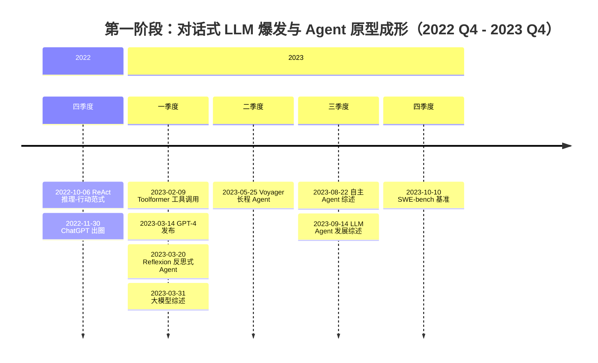
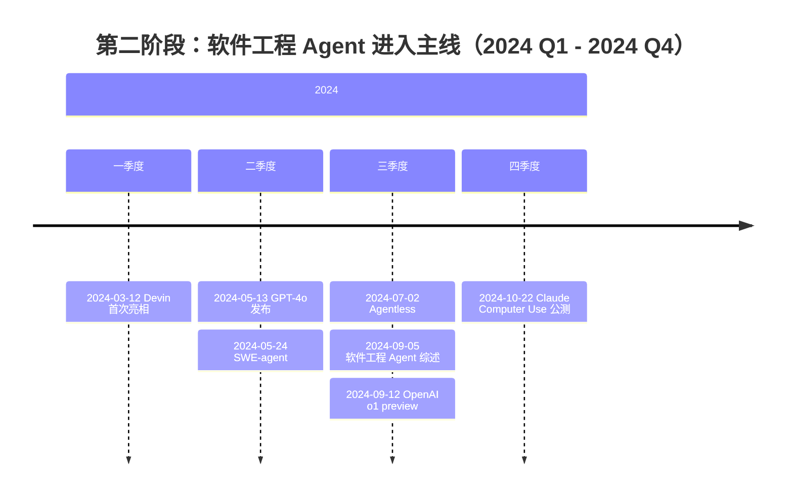
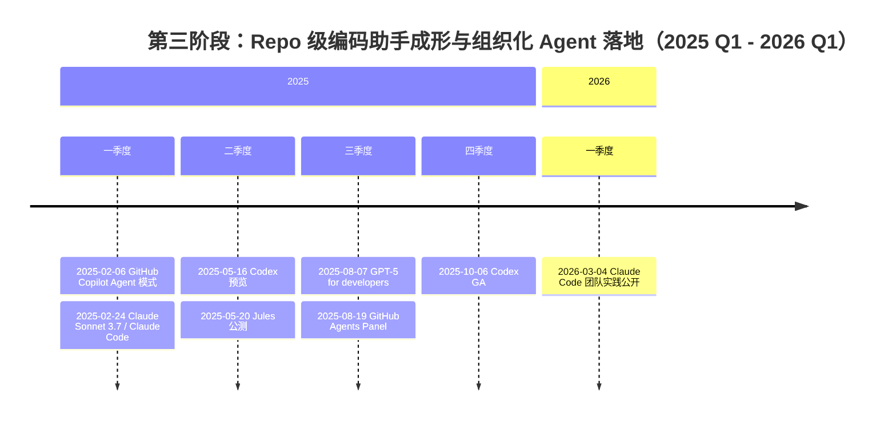
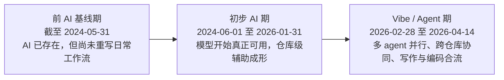
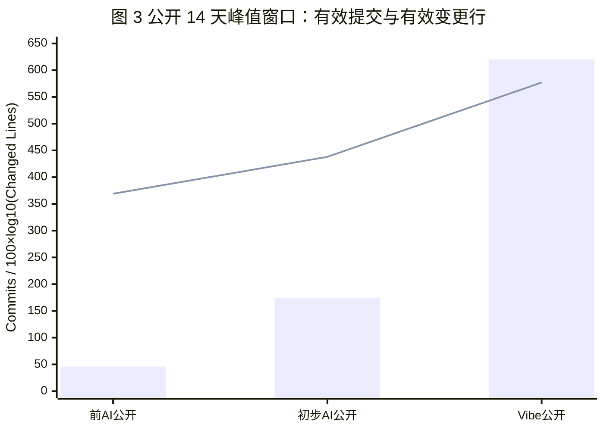
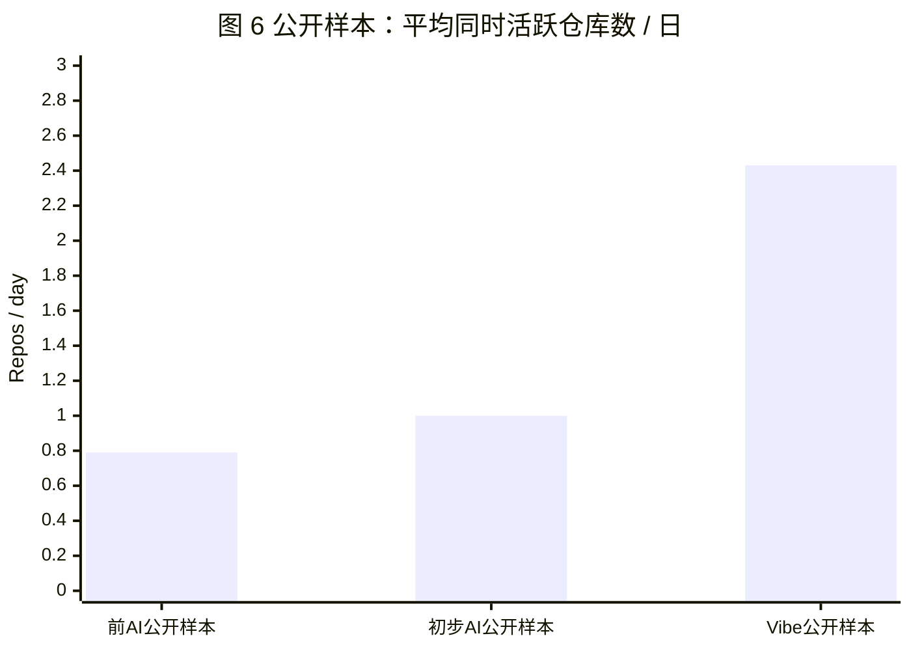

最近这段时间，笔者越来越强烈地意识到一件事：AI在自己的日常工作流程里开始起到越来越重要的作用，而且已经远远不只是一个能帮你写两行docstring或者单元测试或者小函数的玩具。若真要只是那样的话，那说实话，基本已经落后现实半个时代了。为此我觉得，有必要单独就AI这件事拿出来好好说说自己的现状与理解。

然而，问题恰恰也出在这里。今天关于 AI coding 的讨论，太容易滑向两边：一边是“AI 真香”“效率起飞”这种一听就知道没什么信息量的水文；另一边是“工具无罪”“拥抱变化”“保持理性”这种句句正确、却句句无用的空话。前者太浮，后者太轻。说白了，很多文章之所以没有说服力，不是因为它们说错了，而是因为它们没有真的把问题立起来，结果把一个已经剧烈改写现实的东西，写得像一段平平无奇的新闻摘要。

所以这篇文章，笔者更想按一种接近 empirical study 的方式来写：先把问题提出来，再一层一层往下答，而不是一上来就把后文的结论拍在桌上。具体来说，本文至少想回答下面几组问题：

> * `RQ1`：如果把时间线、分期和可复核样本都摆上来，今天的产能变化到底有多大？
> * `RQ2`：AI Coding 到底把今天的工作模式和流程改写成了什么？
> * `RQ3`：这种变化到底有没有把人变轻松？

至于“人在这条链路里真正不可替代的部分到底是什么”以及“今天应当怎样看待 AI 产物的责任边界”这两件事，本文当然也会谈，但它们更适合放到最后的杂谈与个人判断部分，而不是伪装成一个纯靠 Git 统计就能直接闭合的实证问题。

也正因为如此，我会以我自己为研究对象，拿我现在和过去的真实 Git 行为、GitHub 统计，并且进行详实的时间线整理和样本清洗。做这些，并不是为了把文章写成一份“看我最近产能多高”的自我展示报告，而是为了给这些问题提供一个足够具体、足够贴地的回答。笔者确实去翻了自己的 GitHub 记录，也确实做了统计；全文里的详细表格、链接和细粒度拆解，都只使用 `HansBug` 这边已经开放的信息。这样做并不是什么“保守起见”的姿态问题，而是为了把边界收在可复核、可落地、可直接对照的公开样本上。

还有一点也必须先说清楚：这篇文章的主体分析，按“人”做，不按“单个 repo”做——也就是同一个人在同一个时间窗内到底产出了总计多少内容。至于原因，后面的RQ Answer阶段会给出回答——这件事也恰恰是AI Coding带来的非常核心的改变。

## LLM、Agent 与 Coding Agent 的前世今生

如果今天要严肃讨论 AI coding 给工程工作、写作工作和人的脑力分配带来的变化，那么有一条背景线是绕不过去的：我们今天所说的 `AI`，并不是一个单一技术对象，而是一串彼此相连、但层级并不相同的能力演化。`ChatGPT` 爆火[@openai-chatgpt]、`GPT-4` 发布[@openai-gpt4]、`SWE-bench` 提出[@swe-bench]、`Codex` 研究预览[@openai-codex-preview]，以及 `Claude Code` 团队级使用经验公开[@anthropic-claude-code]，都可以被泛泛地归到“AI 来了”这四个字里；但如果不先把这条技术史拆开，后面关于分期、产能和工作流改写的讨论就很容易失焦。原因并不复杂：这些节点对应的，不是同一层级的能力变化，也不是同一层级的工作单元。

从背景上看，今天这套现实至少建立在四条相互叠加的线上。第一条，是生成式大模型本身的演化。这里如果只从 `2022-11` 的 `ChatGPT` 开始看，其实已经太晚了。更早的技术起点至少可以追到 `2017-06`，也就是 Vaswani 等人提出 `Transformer` 架构的时候[@transformer]；真正把“只靠 scale 和预训练就能把语言能力推上去”这件事做成行业共识的，则是 `2020-05` Brown 等人的 `GPT-3`[@gpt3]。紧接着，`2022-03` Ouyang 等人的 `InstructGPT` 把“会续写”推向“会按指令做事”[@instructgpt]，同月 Hoffmann 等人的 `Chinchilla` 把 compute-optimal scaling 摆上台面[@chinchilla]，`2022-04` Chowdhery 等人的 `PaLM` 则把规模化推理与代码能力一起抬高[@palm]。到了 `2022-11`，OpenAI 以产品形态推出 `ChatGPT`[@openai-chatgpt]，而 `2023-02` Touvron 等人的 `LLaMA` 又把高性能开源基座模型拉回了研究共同体[@llama]；接下来 `2023-03` 的 `GPT-4`[@openai-gpt4]、`2024-05` 的 `GPT-4o`[@openai-gpt4o] 与 `2024-09` 的 `o1-preview`[@openai-o1]，则分别把多模态、成本 / 速度与 reasoning 路线继续往前推进。与这条主线并行的，是 Zhao 等人的 `A Survey of Large Language Models`：它初次发表于 `2023-03`，但并不是停留在 `2023` 年的定稿综述，而是一篇截至 `2026-03` 仍在持续更新、当前 arXiv 已经到 `v19` 的 living survey[@llm-survey]。因此，如果只用“一篇 survey”来带过 LLM 的来路，信息实际上是远远不够的。

第二条，是从 LLM 到 agent 的方法论演化。这里的关键问题不再是“模型能不能回答”，而是“模型能不能围绕目标持续做事”。这个转折在文献里并不是凭空出现的。`2022-10`，Yao 等人提出 `ReAct`，把 reasoning 与 acting 首次显式耦合起来[@react]；`2023-02`，Schick 等人提出 `Toolformer`，把工具调用从 prompt 工程层面推向了模型学习层面[@toolformer]；`2023-03`，Shinn 等人的 `Reflexion` 又把反思式反馈引入了 agent 回路[@reflexion]；`2023-05`，Wang 等人的 `Voyager` 则把长程任务与持续探索推进到了更完整的 agent 范式[@voyager]。到了 `2023-08` 与 `2023-09`，Lei Wang 等人与 Zhiheng Xi 等人的两篇 agent 综述，才把记忆、规划、工具使用、环境交互、多 agent 协作这些部件系统性地整理成相对稳定的框架[@autonomous-agent-survey; @agent-rise-survey]。也就是说，agent 这一条线的重点，不是“模型又涨了一点 benchmark”，而是问题的讨论单位从单次回答转向了持续行动。

第三条，是 software engineering agents 自己的形成过程。软件工程并不是 LLM / agent 研究的唯一落点，但它毫无疑问是最先形成稳定 benchmark、稳定任务接口和稳定产品叙事的那条线。`2023-10`，Jimenez 等人的 `SWE-bench` 把真实 GitHub issue resolution 变成了公开 benchmark[@swe-bench]；`2024-05`，John Yang 等人的 `SWE-agent` 则把 repo 浏览、命令执行、补丁生成与测试反馈串成了完整链路[@swe-agent]；`2024-07`，Xia 等人的 `Agentless` 又专门从“去掉复杂 agent 编排后，模型究竟还能做多少工程任务”这个角度做了反向解构[@agentless]。同一时期，市场层面也出现了强烈的产品信号，例如 `2024-03` Cognition 公开 `Devin`[@cognition-devin]。到了 `2024-09`，Liu 等人的《Large Language Model-Based Agents for Software Engineering: A Survey》才把 software engineering agents 的研究范围，从零散 demo 明确抬到了 repo-scale reasoning、tool orchestration、verification loop 与 workflow integration[@se-agent-survey]。换句话说，软件工程 agent 之所以重要，不只是因为它能“写代码”，而是因为它最早把 agent 讨论推进到了可执行、可验证、可比较的工程现实。

第四条，才是今天这篇文章真正关心的组织化、工作流级落地。这里讨论的，已经不是“单个模型”或者“单个论文方法”，而是这些能力怎样被接进真实工作流。`2024-10` Anthropic 把 `computer use` 正式推到公开视野[@anthropic-computer-use]；`2025-02` GitHub 宣布 `Copilot Agent` 模式[@copilot-agent]，同月 Anthropic 在 API release notes 中把 `Claude Sonnet 3.7` 与 `Claude Code` 一并推上工程讨论主线[@anthropic-api-notes]；`2025-05` OpenAI 发布 `Codex` 研究预览[@openai-codex-preview]，Google 公开 `Jules`[@google-jules]；`2025-08` OpenAI 推出 `GPT-5 for developers`[@openai-gpt5-dev]，GitHub 则把 VS Code 里的 `Agents Panel` 推向 GA[@copilot-agents-panel]；`2025-10` OpenAI 又把 `Codex` 做到 generally available[@openai-codex-ga]；最终到 `2026-03`，Anthropic 公开《How Anthropic teams use Claude Code》，这件事才算从“产品能用”进一步走到“团队真的这样用”[@anthropic-claude-code]。也正是在这一层，AI coding 讨论的对象才真正从“会不会写函数”转成“人如何组织一群 agent，去改写自己的日常工作流”。

如果要把上面这些关键节点压缩成一张更清晰的背景表，那么至少可以写成下面这样：

| 时间 | 主线 | 代表性工作 | 作者 / 机构 | 在这条技术线上意味着什么 |
| --- | --- | --- | --- | --- |
| `2017-06` | LLM 基础架构 | `Attention Is All You Need` | Vaswani et al. | `Transformer` 架构奠基，后续大模型路线的技术起点[@transformer] |
| `2020-05` | LLM 规模化 | `GPT-3` | Brown et al. / OpenAI | few-shot prompting 被正式推成行业主叙事[@gpt3] |
| `2022-03` | LLM 对齐 | `InstructGPT` | Ouyang et al. / OpenAI | 从续写转向指令跟随，RLHF 路线成形[@instructgpt] |
| `2022-03` | LLM 训练范式 | `Chinchilla` | Hoffmann et al. / DeepMind | compute-optimal scaling 被明确提出[@chinchilla] |
| `2022-04` | LLM 规模化 | `PaLM` | Chowdhery et al. / Google | 大规模预训练与复杂推理能力继续抬升[@palm] |
| `2022-10` | Agent 方法 | `ReAct` | Yao et al. | reasoning 与 acting 被首次系统耦合[@react] |
| `2022-11` | 对话式产品 | `ChatGPT` | OpenAI | 对话式 LLM 成为大众入口[@openai-chatgpt] |
| `2023-02` | Agent 方法 | `Toolformer` | Schick et al. | 工具调用从技巧走向可学习能力[@toolformer] |
| `2023-02` | 开源 LLM | `LLaMA` | Touvron et al. / Meta | 高性能开源基座模型成为研究共同体新底座[@llama] |
| `2023-03` | 对话式 LLM | `GPT-4` | OpenAI | 复杂任务遵循、写作与推理能力继续提升[@openai-gpt4] |
| `2023-03` | Agent 方法 | `Reflexion` | Shinn et al. | 反思式反馈进入 agent 回路[@reflexion] |
| `2023-03` | 背景综述 | `A Survey of Large Language Models` | Zhao et al. | 截至 `2026-03` 仍在更新的 living survey，系统梳理 LLM 全景[@llm-survey] |
| `2023-05` | Agent 方法 | `Voyager` | Wang et al. | 长程任务与持续探索范式被推进[@voyager] |
| `2023-08` | Agent 综述 | `Autonomous Agents Survey` | Lei Wang et al. | 自主 agent 框架与评测视角系统化[@autonomous-agent-survey] |
| `2023-09` | Agent 综述 | `The Rise and Potential...` | Zhiheng Xi et al. | LLM-based agents 的整体图景被进一步整理[@agent-rise-survey] |
| `2023-10` | SWE Agent | `SWE-bench` | Jimenez et al. | 真实 GitHub issue resolution 成为公开 benchmark[@swe-bench] |
| `2024-03` | SWE 产品 | `Devin` | Cognition | 软件工程 agent 开始进入大众产品叙事[@cognition-devin] |
| `2024-05` | 工作流产品 | `GPT-4o` | OpenAI | 成本、速度与多模态交互进入更高频可用区间[@openai-gpt4o] |
| `2024-05` | SWE Agent | `SWE-agent` | John Yang et al. | repo 浏览、命令执行与补丁生成被串成工程链路[@swe-agent] |
| `2024-07` | SWE Agent | `Agentless` | Xia et al. | 对“必须复杂 agent 编排吗”做出反向拆解[@agentless] |
| `2024-09` | SWE Agent 综述 | `LLM-Based Agents for Software Engineering` | Liu et al. | software engineering agents 范围被系统化界定[@se-agent-survey] |
| `2024-09` | Reasoning 路线 | `o1-preview` | OpenAI | “先想再答”的 reasoning model 路线被公开摆上台面[@openai-o1] |
| `2024-10` | Agent 工具能力 | `computer use` | Anthropic | 计算机操作能力进入公开产品视野[@anthropic-computer-use] |
| `2025-02` | 工作流产品 | `Copilot Agent Mode` | GitHub | repo 级编码 agent 进入主流 IDE 叙事[@copilot-agent] |
| `2025-02` | 工作流产品 | `Claude Sonnet 3.7 / Claude Code` | Anthropic | 编码模型与 CLI 代理形态进一步结合[@anthropic-api-notes] |
| `2025-05` | 工作流产品 | `Codex Preview` | OpenAI | 可执行、可持续追问的 coding agent 路线公开化[@openai-codex-preview] |
| `2025-05` | 工作流产品 | `Jules` | Google | 异步 coding agent 被正式推向开发者[@google-jules] |
| `2025-08` | 开发者模型 | `GPT-5 for developers` | OpenAI | 开发者定向模型 / 工具叙事继续强化[@openai-gpt5-dev] |
| `2025-08` | 工作流产品 | `Agents Panel` | GitHub | 多 agent 面板进入 IDE 日常工作流[@copilot-agents-panel] |
| `2025-10` | 工作流产品 | `Codex GA` | OpenAI | coding agent 从预览走向正式可用[@openai-codex-ga] |
| `2026-03` | 团队实践 | `How Anthropic teams use Claude Code` | Anthropic | 团队级、多 agent 工作流被正式公开总结[@anthropic-claude-code] |

单看文字，还是容易把这条线看散。所以下面直接按三个阶段来展示时间线：第一张图看对话式 LLM 与 Agent 原型期，第二张图看软件工程 Agent 进入主线的过渡期，第三张图看 repo 级编码助手与组织化 Agent 工作流如何真正成形。每张图内部都保留季度格子，因此既能看大阶段，也不会把时间感抹平。为了避免季度线上出现大片空白，图里额外补进了几个非常关键、但前文表格里没逐个展开的节点，例如 `2024-03` 的 Devin 首次亮相、`2024-10` 的 Claude Computer Use 公测、以及 `2025-08` 前后 GitHub agents panel 与 GPT-5 for developers 这些点[@cognition-devin; @anthropic-computer-use; @copilot-agents-panel; @openai-gpt5-dev]。图里同时放了产品发布、方法范式和综述 / 基准三类节点；年份主线与事件框使用不同颜色区分，基本可以直接看出，哪些节点是在推模型能力本身，哪些是在把 agent / software engineering 这套方法论钉实，哪些又是在把它真正推到工程实践里。

之所以要先把这条时间线铺出来，不是为了在文里堆名词，而是为了避免一件特别常见、也特别要命的误判：把不同层级的技术变化混成一个“AI 一直在进步”的含糊叙事。实际上，`ChatGPT` 带来的是自然语言接口普及，`ReAct` 和 agent 综述带来的是“模型如何连续做事”的范式坐标，`SWE-bench` 一类工作带来的是软件工程任务的公开衡量，而 `Codex`、`Claude Code`、`Jules` 这类产品化形态带来的，则是 agent 真正接进生产流之后，工作单元如何被整体改写。把这几层混在一起，后面分期就一定会切歪。

## 研究设计、样本与结果

### 总体定义：研究对象、时代划分与比较对象

本文的实证部分，并不是一个要去证明“AI 一定让人更强”的先验论证，而是一个围绕前述 `RQ` 所做的样本化研究。研究对象只有一个，就是笔者本人在不同技术阶段下的工作痕迹；研究目的也只有一个，就是尽量用可复核、可解释的方式，把工作单元、产能结构和工作负荷究竟发生了什么变化，拆给自己和读者看。

这一步首先要解决的，就是定义问题。原始分期设定里有一个很现实的冲突：“前 AI 时代”写的是 `2024 年 6 月之前`，“初步 AI 时代”写的是 `2024 年 1 月到 2026 年 1 月底`。这两个区间在 `2024-01-01` 到 `2024-05-31` 之间明显重叠。写文章时可以含糊，做研究设计时不能含糊；否则同一段时间会被重复计入，后面无论是 commit 数、活跃仓库数还是产能倍率，都会从坐标系层面先坏掉。

不过，技术史分期和个人工作流分期也不是一回事。前一节回答的是“行业走到了哪里”，这里回答的则是“笔者自己的工作方式究竟是什么时候真的被改写了”。因此，本文最终采用的是下面这组不重叠、且与个人工作方式直接对应的精确分期：

| 时期 | 精确时间范围 | 为什么这么切 |
| --- | --- | --- |
| 前 AI 基线期 | `截至 2024-05-31` | 把 `2024-05-13` 的 GPT-4o 和 `2024` 年中之后更成熟的代码助手浪潮之前的部分，视为“AI 已存在，但尚未重写日常工作流”的基线期。 |
| 初步 AI 期 | `2024-06-01` 到 `2026-01-31` | 这段时间里，模型开始真正可用，仓库级辅助开始成形，AI 从“能玩”变成“能干活”；但多 agent 编排和大规模 vibe 工作流还没有在笔者这里完全爆开。 |
| Vibe / Agent 期 | `2026-02-28` 到 `2026-04-14` | 这里的 `2026-02-28` 是本文统计采用的个人工作流分界点，不是术语诞生日。术语本身在 `2025` 年初就已经流行开来，但术语流行与个人工作方式什么时候真的被改写，本来就不是同一件事。 |

这张图是本文采用的切法：

这个切法和前面的技术时间线是能对上的，但并不是机械对应。对笔者本人而言，所谓前 AI 基线期，说白了就是古法手工编程时期：要么还没有 LLM，要么模型虽然已经出现，但离“能稳定生成可用代码”还差得很远，因此主要工作方式仍然是自己手写、自己查、自己改。初步 AI 期则不一样了，这一阶段模型在一些小型、低难度、通用化任务上已经开始变得稳定，于是我开始尝试把 prompt、上下文说明和代码片段丢给网页上的 LLM，让它先生成一部分内容，我再复制回来接着改；但这个阶段还谈不上什么系统性的 AI 助手编排，更谈不上多 agent 协作。真正的分水岭，是 `2026-02-28` 之后这段时间：到了这里，才进入今天所谓 vibe / agent 时代，也就是 `Codex`、`Claude Code` 这类东西真正玩飞起来的阶段。代码、文档、研究、博客和站点维护不再只是“偶尔让模型帮一下”，而是开始被一起挂进多线程、可并行、可持续追问的 agent 工作流里。行业时间线告诉我这股浪潮是怎么来的，个人工作流分期则告诉我：它到底是什么时候真正打到了我自己身上。

这组定义还隐含了另一个前提：本文的统计单位是“人”，不是“单个 repo”。原因很简单，vibe / agent 时代真正离谱的地方，本来就不是某一个仓库一天多了多少 commit，而是同一个人在同一个时间窗里，能不能同时把代码、文档、研究笔记、博客长文、脚手架和站点维护一起挂起来推进。按单 repo 看，最多只能看见一个局部战场是否热闹；按人看，才更接近这篇文章真正想研究的对象。

### 总体研究设计：证据分层、统一原则与边界

本文的实证部分最终拆成三项互补研究。研究（一）看作者级整体工作面，回答“这些年我平常到底在贡献什么”；研究（二）看公开可复核的 `14` 天峰值窗口，回答“高强度时间窗里公开表面究竟能压到什么程度”；研究（三）则转向本地 `Codex / Claude Code` 使用日志，回答“这些产出背后，agent 是怎样被接进工作流的”。三项研究分别承担不同层级的问题，因此每一项都在自己的小节内单独给出 `定义 / 实验设计 / 实验结果`。

三项研究共用的边界与原则有四条：

1. 统计单位统一按“人”而不是按“单仓库”组织；仓库只是工作面的一个切片，不是本文真正的研究对象。
2. 公开细表、外链与可复核窗口，只使用 `HansBug` 这边已经公开的信息；本地 agent 日志实验则只讨论我自己机器上真实存在的数据源，不展开他人环境，也不把路径级敏感信息直接写进正文。
3. Git 侧统计的统一截止时间仍然是 **2026-04-14**；本地日志侧当前先采用 **2026-04-16** 的单机导出快照作为预检样本，后续若整合多个工作环境，则按 export batch 记录各自导出时间。
4. 总体研究设计这一节只保留全体实验共用的边界、比较原则与证据分层；具体到某项研究内部到底怎么取样、怎么清洗、怎么定义指标，都写回各自的小节里，而不是在总设计里一锅乱炖。

也正因为如此，下面三项研究虽然都在为同一篇文章服务，但它们并不是简单重复，而更像三种互相咬合的镜头：先看工作面，再看公开峰值，再看 agent 工作流本身。这样后面回答 `RQ` 时，才不会一会儿拿 Git 说会话，一会儿拿本地日志说产能，最后把坐标系搅成一锅粥。

### 研究（一）：作者级技术栈画像与清洗后的整体结构

#### 定义：先把长期工作面而不是单一峰值窗口摊开

在看公开可复核的 `14` 天峰值窗口之前，先把更大一层的作者级画像摊开。公开窗口适合回答“高强度输出时到底能压到什么程度”，但它不太回答另一个同样重要的问题：这几年里，笔者平常到底在做些什么，技术栈是怎样迁移的，哪些输出面是一直都在的，哪些东西又是最近才真正被点燃的。

这一项研究按“人”汇总了三个时期里可追到的全部仓库贡献。公开与未公开部分在这里不再拆开写，也不再给未公开部分挂任何仓库信息；它们只作为同一个作者工作面的聚合统计出现。另一方面，这一小节也不拿 raw 总量直接做倍率，因为三个时期长度不同：为了让前 AI 基线期可计算，整体画像部分把它固定为 `2023-01-01` 到 `2024-05-31`；初步 AI 期与 Vibe / Agent 期则继续使用前文已经钉死的边界。这里真正关心的，是结构，不是 headline 数字。

#### 实验设计：按作者级全量贡献做结构化清洗与分类

这一步额外补了一条专门的清洗规则：**文档站点构建产物剔除**。具体来说，就是像 `/_static/`、`/_modules/`、`/_sources/`、`/.doctrees/`、`genindex.html` 以及 `dev / main / vX.Y.Z` 这类版本化文档根目录下的 HTML / CSS / JS / IPYNB 副本，都不再算进有效产能。原因很直接：如果不把这类东西单独踢出去，前 AI 与初步 AI 两期会被 Sphinx / nbsphinx / mike 之类工具生成出来的静态站点副本直接顶歪，最后看到的不是“人到底写了什么”，而是“某次文档部署把多少站点表面一起铺平了”。

为了避免后面的表把人看晕，两个口径先说明白：

1. `触达提交数` 指某个类别在多少个有效提交里出现过；一条提交如果同时改了 Python 和 Markdown，就会在两个类别里各记一次。所以这组比例不能机械相加到 `100%`，它更像“这一类工作在该时期里有多常见”。
2. `有效变更行` 则是严格可加的；所有排除规则先走一遍，剩下的变更行再按类别汇总，因此行数占比之和为 `100%`。

作者级画像里使用的类别桶，比后面公开窗口那组 `py / node / md / other` 再细一层，固定分成 `Python生态`、`Web/Node前端`、`文档/写作`、`工程化/Workflow`、`原生/系统`、`配置/元数据` 与 `其他` 七类。这样做的目的，不是把表做得更花，而是为了更接近笔者真实的工作面：今天很多工作根本就不是“只有代码”或者“只有文档”，而是代码、配置、工作流、文档和页面一起往前走。至于这里的 `其他`，主要指的是那些很难稳定归入前六类、但又确实构成工程产出的杂项文件，例如少量未归类的纯文本、模板片段、领域化说明文件、无明显语言后缀的工具文件，以及一些零散的结构化中间材料。

#### 实验结果：三时期技术栈与产出结构的整体画像

#### 表 1：作者级三时期总体口径概览

| 时期 | 时间范围 | authored commit | merge commit | non-merge commit | 有效提交 | 有效变更行 | 清洗后归零提交 |
| --- | --- | ---: | ---: | ---: | ---: | ---: | ---: |
| 前 AI 基线期 | `2023-01-01` ~ `2024-05-31` | `5,107` | `192` | `4,915` | `4,784` | `1,668,687` | `131` |
| 初步 AI 期 | `2024-06-01` ~ `2026-01-31` | `3,734` | `153` | `3,581` | `3,541` | `621,416` | `40` |
| Vibe / Agent 期 | `2026-02-28` ~ `2026-04-14` | `1,637` | `109` | `1,528` | `1,508` | `1,821,541` | `20` |

表 1 先把总体口径摆在桌面上。它的用途不是直接拿来算三时期倍数，因为三个时期的长度并不对称；这张表更像是样本规模说明书，告诉读者后面的类别占比和排除规则，究竟是落在多大一片作者工作面之上的。就这一层看，Vibe / Agent 期虽然时间最短，但清洗后的 `有效变更行` 反而已经高于初步 AI 期整段窗口；这恰恰说明，后面再谈公开 `14` 天峰值窗口时，为什么会那么夸张。

#### 表 2：作者级类别触达提交数及占比

| 类别 | 前 AI 基线期 | 初步 AI 期 | Vibe / Agent 期 |
| --- | ---: | ---: | ---: |
| Python生态 | `1,775` (`37.1%`) | `2,248` (`63.5%`) | `480` (`31.8%`) |
| Web/Node前端 | `210` (`4.4%`) | `425` (`12.0%`) | `90` (`6.0%`) |
| 文档/写作 | `2,020` (`42.2%`) | `599` (`16.9%`) | `1,140` (`75.6%`) |
| 工程化/Workflow | `690` (`14.4%`) | `510` (`14.4%`) | `179` (`11.9%`) |
| 原生/系统 | `0` (`0.0%`) | `16` (`0.5%`) | `35` (`2.3%`) |
| 配置/元数据 | `124` (`2.6%`) | `141` (`4.0%`) | `126` (`8.4%`) |
| 其他 | `1,006` (`21.0%`) | `1,006` (`28.4%`) | `445` (`29.5%`) |

表 2 看的是“这一类工作在有效提交里有多常见”。结果很有意思：前 AI 基线期触达最频繁的，其实已经是 `文档/写作` 与 `Python生态` 两条线并行；初步 AI 期则明显转成 `Python生态` 主导；而到了 Vibe / Agent 期，`文档/写作` 的触达占比直接拉到 `75.6%`，说明今天的工作早就不是“先写完代码，有空再补文档”的节奏了，而是知识外化本身已经被拉回主流程。

```mermaid
%% series-labels: Python生态|Web/Node前端|文档/写作|工程化/Workflow|原生/系统|配置/元数据|其他
%% series-colors: #5aa9e6|#7fc8a9|#f2c14e|#ef476f|#6c5ce7|#8d99ae|#ff9f1c
xychart-beta
    title "图 1 作者级类别触达提交占比"
    x-axis ["前AI", "初步AI", "Vibe"]
    y-axis "Percent of Effective Commits" 0 --> 80
    bar [37.1, 63.5, 31.8]
    bar [4.4, 12.0, 6.0]
    bar [42.2, 16.9, 75.6]
    bar [14.4, 14.4, 11.9]
    bar [0.0, 0.5, 2.3]
    bar [2.6, 4.0, 8.4]
    bar [21.0, 28.4, 29.5]
```

图 1 改成了按时期分组三个柱子组、每组内再并列放七个类别，这样更容易直接看出每个时期的整体工作结构。它最值得注意的地方，不是某一根柱子有多高，而是三时期的主导工作面真的换了两次：从前 AI 期的 `Python + 文档` 双线常态，到初步 AI 期的 `Python` 明显压顶，再到今天 `文档/写作` 反过来成了最常见的工作面。

#### 表 3：作者级有效变更行及占比

| 类别 | 前 AI 基线期 | 初步 AI 期 | Vibe / Agent 期 |
| --- | ---: | ---: | ---: |
| Python生态 | `238,644` (`14.3%`) | `265,133` (`42.7%`) | `243,246` (`13.4%`) |
| Web/Node前端 | `930,835` (`55.8%`) | `219,247` (`35.3%`) | `100,776` (`5.5%`) |
| 文档/写作 | `197,092` (`11.8%`) | `32,207` (`5.2%`) | `892,568` (`49.0%`) |
| 工程化/Workflow | `20,855` (`1.2%`) | `20,155` (`3.2%`) | `6,789` (`0.4%`) |
| 原生/系统 | `0` (`0.0%`) | `3,808` (`0.6%`) | `11,453` (`0.6%`) |
| 配置/元数据 | `250,727` (`15.0%`) | `43,541` (`7.0%`) | `240,691` (`13.2%`) |
| 其他 | `30,534` (`1.8%`) | `37,325` (`6.0%`) | `326,018` (`17.9%`) |

如果说表 2 看的是“常见度”，那么表 3 看的是“真正落在工程表面上的体量”。这一层里，前 AI 与初步 AI 两期都能看到一块不小的 `Web/Node前端` 体量；这并不意味着笔者那时主要在做前端，而更像说明当时相当一部分实际产物，会以页面、可视化、静态结果页或配套站点的形式落地。到了 Vibe / Agent 期，结构就很不一样了：`文档/写作` 的有效变更行直接占到 `49.0%`，与此同时 `Python生态`、`配置/元数据` 与 `其他` 也都还在高位。这种分布更像今天真实的工作形态：长文、研究笔记、知识索引、站点内容、代码实现和配套配置一起推进，而不是谁等谁。

```mermaid
%% series-labels: Python生态|Web/Node前端|文档/写作|工程化/Workflow|原生/系统|配置/元数据|其他
%% series-colors: #5aa9e6|#7fc8a9|#f2c14e|#ef476f|#6c5ce7|#8d99ae|#ff9f1c
xychart-beta
    title "图 2 作者级有效变更行占比"
    x-axis ["前AI", "初步AI", "Vibe"]
    y-axis "Percent of Effective Changed Lines" 0 --> 60
    bar [14.3, 42.7, 13.4]
    bar [55.8, 35.3, 5.5]
    bar [11.8, 5.2, 49.0]
    bar [1.2, 3.2, 0.4]
    bar [0.0, 0.6, 0.6]
    bar [15.0, 7.0, 13.2]
    bar [1.8, 6.0, 17.9]
```

图 2 也改成了同样的“按时期成组”画法，因此每个时期的整体体量结构会更一眼可见。初步 AI 期最像“AI 开始能帮我稳定推进主线代码”的时期，`Python生态` 行数占比最高；而 Vibe / Agent 期则明显转成 `文档/写作` 与 `Python / 配置 / 其他` 并行推进的结构。这不是“少写代码了”，而是代码终于不再是唯一显性的落地产物。

#### 表 4：清洗规则与被排除内容规模

这里的计数单位是 **被排除的文件变更记录数 / 被排除的变更行数**。前者回答“这种噪声有多常见”，后者回答“这种噪声能把图表顶歪到什么程度”。

| 规则 | 代表内容 | 前 AI 基线期 `命中 / 行数` | 初步 AI 期 `命中 / 行数` | Vibe / Agent 期 `命中 / 行数` |
| --- | --- | ---: | ---: | ---: |
| 文档站点构建产物 | `/_static/`、`/_modules/`、`main/`、`v1.4.4/` 一类版本化文档副本 | `923,879 / 25,370,771` | `1,061,783 / 12,728,971` | `26 / 40` |
| 二进制 / 资源文件 | `png/svg/pdf/pt/...` | `9,873 / 1` | `651 / 71,338` | `4,571 / 19,975` |
| 大体量数据快照 | `json/txt/csv >= 1000 行` | `199 / 1,035,926` | `3 / 1,464,077` | `935 / 3,126,871` |
| 显式噪声文件 | `paper_content.txt`、`oldBlogCatalog.*` | `0 / 0` | `0 / 0` | `1,968 / 1,746,781` |
| 构建 / 缓存 / 镜像路径 | `dist/`、`build/`、`vendor/`、`node_modules/` | `2 / 6` | `23 / 743` | `10,728 / 1,012,618` |
| 生成式语法产物 | `generated/`、`*Lexer.*`、`*Parser.*` | `0 / 0` | `354 / 140,276` | `72 / 41,826` |
| 计划台账 JSON | `plans/*.json` | `0 / 0` | `0 / 0` | `46 / 214,937` |
| 锁文件 | `yarn.lock` 等 | `1 / 367` | `0 / 0` | `32 / 26,690` |

表 4 基本上把这次准备排掉的东西全摊出来了。最离谱的当然是文档站点构建产物：光这一项，前 AI 基线期就命中了 `923,879` 条文件变更记录、`25,370,771` 行；初步 AI 期更是过了千万行。也正因为这一层被单独剔掉，前两期的结构才终于从“被静态站点副本糊一脸”回到了“人到底做了什么”的坐标系里。另一方面，Vibe / Agent 期真正膨胀的噪声则明显换成了另一拨：`paper_content.txt` 这类显式噪声文件、大体量数据快照、构建镜像路径与计划台账 JSON。这也很符合今天的工作现实：AI 真正把流水线拉起来之后，被顺手批量铺开的，不只是代码，还有研究资料、账本和中间产物。

如果把这些结构合起来看，三个时期的技术画像其实已经很清楚了，而且这种清楚并不只是表上的几个百分比，而是三种很不一样的日常工作状态：
* 前 AI 基线期，更像很多老程序员都很熟悉的那种生活：白天盯着一个主问题硬啃，主要产出是 Python 库、工具代码、少量配套页面和文档；遇到一个接口要改、一组测试要补、一段实现要重构，基本都得自己一寸一寸地推过去。那个时期的 `Python生态`、`Web/Node前端`、`文档/写作` 其实都已经在场，只是它们还没有被一套统一工作流拧成整体，所以体感上更像“代码是主菜，文档和页面是吃完饭后还得顺手收拾的桌子”。
* 初步 AI 期则是另一种味道：这时日常状态开始变成“主线代码我还在亲自控盘，但一些小型、低难度、通用化的展开动作已经可以先扔给模型试一轮”。于是最直观的变化，就是 Python 主线被明显放大了，很多精力开始集中在库设计、接口整理、实现推进、测试补齐和工程细节打磨上，产出看起来也更像一段时间内持续把几个代码型项目往深里推。
* 到了 Vibe / Agent 期，日常状态就几乎完全不是一回事了：一天里同时挂着代码、长文、研究笔记、站点内容、配置整理、知识索引和若干中间材料，已经变成常态；手里盯着的不再只是“这个函数怎么写”，而是“这条线今天要不要推进、资料要不要沉淀、页面要不要同步、结构要不要顺手重整”。所以这时的技术栈画像才会变成今天这个样子：`文档/写作` 冲到最前面，`Python生态` 仍然很强，`配置/元数据` 与 `其他` 也一起抬头。换句话说，这一阶段的真实产出，已经不是单纯的代码文件，而是代码、写作、研究、站点和知识资产被一并持续生产出来的整套工作表面。

也正因为如此，下文才必须回到公开可复核的 `14` 天峰值窗口。作者级画像回答的是“这几年我平常在干什么”，而峰值窗口要回答的，则是“当这整张工作面被压到同一个高强度时间窗里时，它到底能夸张到什么程度”。

### 研究（二）：公开样本的窗口结构与倍率

#### 定义：只看公开可复核的高强度峰值窗口

这一项研究只看 `HansBug` 这边已经公开、而且可以完整复核的样本窗口。它的研究对象不是作者级长期画像，而是三个时期里各自最密集的一段 `14` 天时间窗；研究目标则是回答“当公开表面真的被压到高强度状态时，commit、代码量、语言构成与提交形态究竟会长成什么样”。

#### 实验设计：先用贡献层选窗，再用落地层拆结构

这次统计在公开样本里用了两层口径。第一层是 GitHub `contributionsCollection` 里的 `commit contribution`，它回答的是“在一个连续时间窗里，作为这个人，我总共发生了多少次跨仓库的有效提交活动”。这一层最适合做峰值窗口筛选，因为它天然按“人”而不是按某个仓库在看。第二层是 GitHub 默认分支 landed commit 对应的落地层指标，包括 landed commit、非 merge commit、修改文件数、增删行，以及提交更偏代码还是更偏文档。它回答的是另一个问题：这些高强度窗口最后到底在工程表面上落成了什么。

两层都要用，原因并不复杂。只看贡献层，就只能知道“很忙”，却不知道忙出来的是代码、文档、测试还是一堆杂项；只看落地层，又很容易被默认分支策略、merge 方式、批量 sweep、大型导入和 API 技术细节带偏。尤其是今天这种多 agent、多分支、多仓库同时推进的工作流，如果只盯 landed commit，很多实际上已经发生过的密集劳动会被压扁；但如果只盯 contribution，又会把产物结构抹平。所以本文的做法是先用贡献层找峰值窗口，再用落地层拆细节，最后把两者放在一起看。

另外，本文在公开样本的落地层额外定义了一个 **有效变更行** 指标。它的计算方式很直接：先排除 merge commit 的重复 diff，再从非 merge 提交里去掉几类明显不适合直接当作“有效产能”的文件，包括自动生成的 parser/lexer 产物、锁文件、批量导入的论文全文转储 `paper_content.txt`、vendored 资源、自动生成的旧站目录账本，以及少数明显台账型 JSON。保留下来的，才是本文后面真正拿来比较的“有效变更行”。换句话说，本文不是不用 raw 行数，而是把 raw 行数当作表面规模信号，把清洗后的有效变更行当作更接近真实工作量的信号。

#### 实验结果：公开窗口中的并行度、代码量与提交形态

先看公开样本。这里的窗口，都是按“人”的维度，在对应时期里挑出的 14 天高强度窗口；表里给出的公开仓库链接，都可以直接点进去核对。

#### 表 5：公开样本的 14 天峰值窗口（贡献层，按人、跨仓库）

| 时期 | 时间窗 | 14 天 `commit contribution` | 活跃天数 | 日均贡献提交 | 平均活跃仓库数/日 | 峰值同时活跃仓库数 | 主要公开仓库 |
| --- | --- | ---: | ---: | ---: | ---: | ---: | --- |
| 前 AI 基线期 | `2023-02-22` ~ `2023-03-07` | 117 | 8 | 8.36 | 0.79 | 2 | [opendilab/treevalue](https://github.com/opendilab/treevalue) 101、[HansBug/hbutils](https://github.com/HansBug/hbutils) 9、[HansBug/fake_html](https://github.com/HansBug/fake_html) 7 |
| 初步 AI 期 | `2025-06-13` ~ `2025-06-26` | 264 | 12 | 18.86 | 1.00 | 2 | [HansBug/pyfcstm](https://github.com/HansBug/pyfcstm) 234、[HansBug/plantumlcli](https://github.com/HansBug/plantumlcli) 30 |
| Vibe / Agent 期 | `2026-04-01` ~ `2026-04-14` | 635 | 14 | 45.36 | 2.43 | 4 | [HansBug/research_ideas](https://github.com/HansBug/research_ideas) 328、[HansBug/hubvault](https://github.com/HansBug/hubvault) 139、[HansBug/HansBug.github.io](https://github.com/HansBug/HansBug.github.io) 102、[HansBug/pyfcstm](https://github.com/HansBug/pyfcstm) 46、[HansBug/python-ai-cheatsheet](https://github.com/HansBug/python-ai-cheatsheet) 11、[HansBug/deck-workflow-skill](https://github.com/HansBug/deck-workflow-skill) 7、[HansBug/jml-openjml-field-guide](https://github.com/HansBug/jml-openjml-field-guide) 2 |

表 5 先给出了三段公开可复核窗口在 contribution-layer 上的基本结构。就结果本身看，前 AI 基线期主要集中在 `treevalue` 与少量配套仓库；初步 AI 期则高度集中在 `pyfcstm`；而 `2026-04-01` 到 `2026-04-14` 这一段公开窗口，已经同时覆盖研究写作、存储框架、博客站点、DSL / 框架推进、速查手册、技能脚手架与调研导览等多类输出面。与之对应，平均活跃公开仓库数从 `0.79` 提高到 `2.43`，峰值同时活跃公开仓库数从 `2` 提高到 `4`。

#### 表 6：公开样本的 14 天峰值窗口（落地层，加入清洗后的有效代码量）

| 时期 | 时间窗 | landed commit | 非 merge commit | 有效提交 | raw changed lines | 非 merge changed lines | 有效变更行 |
| --- | --- | ---: | ---: | ---: | ---: | ---: | ---: |
| 前 AI 基线期 | `2023-02-22` ~ `2023-03-07` | 60 | 46 | 46 | 7,964 | 4,914 | 4,914 |
| 初步 AI 期 | `2025-06-13` ~ `2025-06-26` | 174 | 174 | 174 | 47,425 | 47,425 | 23,980 |
| Vibe / Agent 期 | `2026-04-01` ~ `2026-04-14` | 639 | 622 | 620 | 5,943,848 | 3,303,799 | 587,672 |

表 6 给出了公开样本在 landed-layer 上的结果，并把 `raw changed lines`、`non-merge changed lines` 与清洗后的 `有效变更行` 分开呈现。结果显示，当前公开 Vibe 窗口的 `raw changed lines` 达到 `5,943,848`，其中包括大规模 merge diff 和明显机器产物；在清洗掉这些部分之后，`有效变更行` 仍然达到 `587,672`，对应前 AI 公开窗口的 `4,914` 与初步 AI 公开窗口的 `23,980`。

把 commit 数和代码量放在同一张图里看，会更直观一些。严格来说，这张图本来应该画双纵轴；但 `Mermaid` 原生并不支持双 `y-axis`，所以这里只能退一步，把“有效变更行”按 `100 × log10(lines)` 的方式投射成折线，左边的柱子仍然保留真实的有效提交数。原始数值以表 6 为准，图只负责把趋势压到同一视野里：

图 3 只是把表 6 的两类结果压到同一视野中。它不单独承担解释任务，只负责把 `有效提交` 与 `有效变更行` 的相对量级放到一张图上展示。

语言分布再往下拆，就更能看出三个窗口的结构差异了：

| 时期 | `py` | `node` | `md` | `other` |
| --- | ---: | ---: | ---: | ---: |
| 前 AI 基线期 | `1,927` (`39.2%`) | `0` | `195` (`4.0%`) | `2,792` (`56.8%`) |
| 初步 AI 期 | `20,635` (`86.1%`) | `0` | `1,930` (`8.0%`) | `1,415` (`5.9%`) |
| Vibe / Agent 期 | `83,021` (`14.1%`) | `26,413` (`4.5%`) | `435,666` (`74.1%`) | `42,572` (`7.2%`) |

这里的 `other` 指的是 `Cython / workflow / Makefile / CSS / 配置与杂项结构文件` 这类既不归入 `py`、也不归入 `md` 的变更。结果上看，前 AI 公开窗口中 `other` 占比相对较高；初步 AI 公开窗口以 `py` 为绝对主导；而当前 Vibe 窗口中 `md` 占比达到 `74.1%`。

```mermaid
%% series-labels: Python|Node|Markdown|其他
%% series-colors: #8fd6ff|#f2c16d|#8fe1ba|#ff9bb0
xychart-beta
    title "图 4 三个时期的语言构成占比"
    x-axis ["前AI", "初步AI", "Vibe"]
    y-axis "Percent" 0 --> 100
    bar [39.2, 86.1, 14.1]
    bar [0.0, 0.0, 4.5]
    bar [4.0, 8.0, 74.1]
    bar [56.8, 5.9, 7.2]
```

如果再按提交主导形态去分，差异会更刺眼：

| 时期 | 文档型提交 | 代码型提交 | 混合型提交 |
| --- | ---: | ---: | ---: |
| 前 AI 基线期 | `1` (`2.2%`) | `34` (`73.9%`) | `11` (`23.9%`) |
| 初步 AI 期 | `6` (`3.4%`) | `144` (`82.8%`) | `24` (`13.8%`) |
| Vibe / Agent 期 | `182` (`29.4%`) | `77` (`12.4%`) | `361` (`58.2%`) |

按提交主导形态统计时，前 AI 基线期与初步 AI 期的代码型提交分别为 `73.9%` 与 `82.8%`；而当前 Vibe / Agent 期中，混合型提交占比达到 `58.2%`，文档型提交占比达到 `29.4%`。这组结果与前面的语言分布一起，构成了 landed-layer 上的结构性差异。

```mermaid
%% series-labels: 文档型|代码型|混合型
%% series-colors: #8fe1ba|#8fd6ff|#f2c16d
xychart-beta
    title "图 5 三个时期的提交主导形态占比"
    x-axis ["前AI", "初步AI", "Vibe"]
    y-axis "Percent" 0 --> 100
    bar [2.2, 3.4, 29.4]
    bar [73.9, 82.8, 12.4]
    bar [23.9, 13.8, 58.2]
```

### 研究（三）：本地 Codex / Claude Code 使用日志

#### 定义：从本地 agent 日志观察工作流内部机制

前面两项研究说明了 Git 表面的产出结构，却还没有真正回答另一个更深一层的问题：这些产出背后，agent 到底是以怎样的密度、怎样的并行方式、怎样的人工裁决节奏被接进工作流的。也正因为如此，这里单独引入一项本地日志研究，基于 `Codex` 与 `Claude Code` 的真实使用记录，把会话级、任务级和切换级证据补齐。

这组研究的边界也得先说清楚：它主要服务于 `RQ2` 与 `RQ3`，也主要对应 Vibe / Agent 期，因为前 AI 基线期与初步 AI 期并不存在同等粒度、同等形态的本地 agent 历史日志。换句话说，它更适合回答“今天的工作流究竟是怎么被改写的”，而不直接承担跨三时期总量倍率的比较任务。

更重要的一点是，这一项研究后续并不会只停在当前这台机器上。笔者后面实际需要整合多个工作环境上的 `Codex / Claude Code` 数据，因此这项研究从一开始就必须按“多环境、分批导出、统一 schema、下游合并”的方式设计，而不是把某一台机器上的一次导出误当成最终全貌。

#### 实验设计：以统一导出 schema 组织单机与多环境日志

本研究当前采用的基础工具，是 [HansBug/agent-records-exporter](https://github.com/HansBug/agent-records-exporter) 这一套本地导出器[@agent-records-exporter]。它会同时读取 `~/.codex` 与 `~/.claude`，并统一导出 `session`、`message`、`turn`、`tool_call`、`history`、`log` 与 `event` 七类记录；输出层则同时保留 `agent_records.parquet`、若干 CSV 明细表以及 `summary.json`。这一点很关键，因为后续真正做分析时，既需要 long-table 层的统一抽样，也需要按表检查细节和做人工复核。

从字段上看，这套导出器已经足够支撑一组严肃的工作流级指标。为了避免后面只剩下一串 schema 名字，先把研究（三）真正会用到的关键字段与用途摊成表：

#### 表 7：研究（三）关键字段与分析用途

| 记录层 | 关键字段 | 主要用途 |
| --- | --- | --- |
| `session` | `agent_type`、`session_key`、`session_id` | 统一会话主键、区分 `codex` 与 `claude_code`、完成跨表 join |
| `session` | `model_provider`、`model`、`reasoning_effort` | 区分模型路线与推理档位，避免把不同能力设定混在一起比较 |
| `session` | `cwd`、`git_branch`、`git_origin_url` | 把会话重新锚回真实工作目录、仓库与分支，支撑 repo 级切换分析 |
| `session` | `approval_mode`、`sandbox_policy` | 区分权限边界与运行约束，避免把受限会话与高权限会话直接并列 |
| `session` | `duration_seconds`、`turn_count`、`tool_call_count`、`exec_command_count`、`web_search_count`、`patch_apply_count` | 估计单会话工作强度、工具依赖度与执行型特征 |
| `session` | `history_count_delta`、`issue_count` | 观察 history 对齐质量、异常会话比例与明显摩擦点 |
| `turn` | `status`、`abort_reason`、`duration_seconds`、`commentary_message_count`、`final_answer_message_count` | 判断单轮是顺利收口、中途打断，还是主要停留在 commentary 阶段 |
| `tool_call` | `tool_name`、`duration_seconds`、`exit_code`、`cwd`、`command_json`、`parsed_cmd_json`、`changes_count` | 下钻具体工具结构、命令行为、执行代价与潜在改动强度 |

这里面真正关键的，不是某一个孤立字段，而是几组字段之间的组合关系。

第一组是 `session_key / agent_type / session_id`。这三者决定了后续所有分析能不能站稳。原因很简单：研究（三）不是在做一份聊天导出，而是在做一份跨 `Codex` 与 `Claude Code` 的统一工作流数据集。如果连最基本的会话主键都立不住，那么后面的 turn、tool call、history 和 log 就都只能是一堆散片，谈不上什么严肃分析。

第二组是 `cwd / git_branch / git_origin_url`。这组字段的重要性，怎么强调都不为过。因为本文真正关心的不是“今天模型说了多少话”，而是“这些会话究竟锚在什么工作环境里”。`cwd` 把会话拉回到具体目录，`git_branch` 说明它当时落在哪条开发支线上，`git_origin_url` 则进一步把本地目录重新锚回远端仓库。没有这组字段，后面要谈跨 repo 切换、多任务并行、同日多仓回流，几乎都只能凭感觉；有了这组字段，很多原本只是体感的东西才第一次变成了可测对象。

第三组是 `model_provider / model / reasoning_effort` 再加上 `approval_mode / sandbox_policy`。前者回答的是“这次到底调用的是哪类模型、哪档推理强度”，后者回答的是“这次会话在什么权限边界与运行约束下展开”。这两层必须放在一起看，因为同样是一个 session，高推理档位、宽权限边界和严格沙箱下的工作形态，根本不是一回事。后续如果要比较不同会话的工具密度、完成度或者人工插手频率，不把运行约束和模型设定一起交代清楚，结论会很虚。

第四组是 `duration_seconds / turn_count / tool_call_count`，以及 `turn` 表里的 `status / abort_reason`，再加上 `tool_call` 表里的 `tool_name / exit_code / changes_count`。这组字段共同回答的是“这条任务线到底是怎么推进的”。一条会话持续多久、包含多少轮、调用了多少次工具、最后是完成还是中断、是在哪一类工具上反复打转、有没有明显失败退出，这些信息合在一起，才真正接近后文要谈的“工作流密度”和“人工裁决负担”。

最后一组是 `history_count_delta / issue_count`。这两个字段看起来不如前面那几组显眼，但在方法论上非常重要，因为它们直接关系到数据质量与摩擦识别。`history_count_delta` 能提示 history 对齐是否稳定，`issue_count` 则能把那些已经被 exporter 显式标出来的异常 session 单独拎出来。后续只要涉及 session 质量筛选、异常剔除或者人工复核抽样，这两个字段都会是最先要看的入口。

从当前单机预检看，关键字段的可用性也足以支持正式设计。以 `2026-04-16` 这次导出为例，`session` 级字段里，`model_provider` 非空 `130 / 136`，`model` 非空 `116 / 136`，`reasoning_effort` 非空 `104 / 136`，`cwd` 非空 `130 / 136`，`git_branch` 非空 `81 / 136`，`git_origin_url` 非空 `55 / 136`，`approval_mode` 非空 `108 / 136`，`sandbox_policy` 非空 `104 / 136`，`duration_seconds` 非空 `130 / 136`。这意味着后续真正要做模型分布、repo 锚定、审批策略、沙箱环境、时长密度和工作环境切换分析，并不是空中楼阁，而是已经有相当一部分 session 能提供可靠支撑。

基于这些已知字段，本文后续准备把研究（三）的指标分成六组来做：

1. `会话规模`：`session_count`、`session_count_by_agent`、`sessions/day`、`active_days`，用于回答当前工作流的基本展开规模。
2. `交互密度`：`message_count/session`、`turn_count/session`、`tool_call_count/turn`，以及 `exec_command`、`web_search`、`apply_patch` 等工具调用密度，用于回答 agent 是否已经从“偶尔帮一下”走到“高频嵌入主流程”。
3. `会话完成度与摩擦`：`completed_turn_count`、`aborted_turn_count`、`incomplete_turn_count`、`history_count_delta`、`history_mismatch_count`、`issue_count`，用于回答一条任务线到底是顺滑推进，还是大量依赖人工纠偏与重新喂上下文。
4. `工作流锚定`：`cwd`、`git_branch`、`git_origin_url`、`model_provider`、`model`、`reasoning_effort`、`approval_mode`、`sandbox_policy`，用于把 agent 会话重新锚回真实工程环境，而不是只看聊天文本。
5. `并行与切换`：基于 `created_at / updated_at / first_event / last_event` 的时段重叠、按 `cwd` 或 repo 的相邻切换、同日多 session 回流等派生指标，用于回答“多线程工作”到底是感觉上更忙，还是数据上真的更高频切换。
6. `人工裁决负担`：以 `user_message_count`、`history` 对齐情况、turn 中断、issue session 和工具链中断事件为基础，派生出“人类主动插手密度”“纠偏节点密度”“需要重新定边界的频次”等指标，用来服务 `RQ3`。

考虑到后续要整合多个工作环境，这项研究在方法上还要补一条专门的多环境合并原则：每一个工作环境都应当先在本地独立导出，再在下游分析阶段补 `environment_id`、`environment_label`、`export_batch_id`、`exported_at_utc` 这类批次级元信息，然后按统一 schema 做 union。也就是说，后续需要被合并的是“标准化后的导出结果”，而不是不同机器上的原始日志直接拼接。这样做的原因很简单：路径、系统环境、工具版本、时间边界都可能不同，只有先在各自环境里完成一次稳定抽取，后面按 batch 合并才不会把数据源本身搞脏。

#### 实验结果：当前单机预检已经能拿到的真实规模

在完整分析正式展开之前，至少可以先给出一份当前单机预检摘要，说明这项研究不是凭空设想，而是已经有真实可用的数据基础：

#### 表 8：研究（三）当前单机预检摘要（`2026-04-16`）

| 项目 | 当前单机预检结果 |
| --- | --- |
| 导出时间 | `2026-04-16` |
| 时间覆盖 | `2026-04-09` ~ `2026-04-16` |
| 有活动日期 | `6` 天 |
| session 总数 | `136` |
| 其中 `codex / claude_code` | `110 / 26` |
| message 总数 | `4,742` |
| turn 总数 | `385` |
| tool call 总数 | `14,949` |
| log 总数 | `14,707` |
| issue session 数 | `44` |

- `TODO`：补本地 `Codex / Claude Code` 使用日志分析。
- `TODO`：补这一小节对应的正式统计表、图与结果解读。
- `TODO`：补多工作环境导出后的 union 规则与汇总口径。
- `TODO`：待本小节补完后，再作为 `RQ2` 与 `RQ3` 的关键证据链之一回填到后文。

## 回到开头的三个问题

前面的研究设计、样本与结果，主要是在把坐标系钉死；从这里开始，才真正回到开头那三个 `RQ`。不过也得先把话说清楚：`RQ1` 现在已经可以靠公开可复核样本给出比较硬的回答；`RQ2` 则还差研究（三）这一层工作流级证据；`RQ3` 更不能提前拍板，它得建立在 `RQ1` 与 `RQ2` 都基本站稳之后再谈。也正因为如此，这一节里会同时出现正式回答、阶段性判断和明确写出来的 `TODO`。

### RQ1：如果把时间线、分期和可复核样本都摆上来，今天的产能变化到底有多大？

这个问题其实已经不太含糊了。只要把前面的分期、公开窗口、清洗规则和落地层指标一起摆上来，结论就很难再往“小幅提升”那边糊弄：今天的产能变化，已经不是“有点快了”，而是工作单元被重写之后，整体输出规模和并行度都发生了量级切换。

#### 表 9：公开样本的关键倍率（更贴近“干成了多少事”）

| 对比口径 | 前 AI 公开窗口 | 初步 AI 公开窗口 | 当前 Vibe 公开窗口 | `Vibe / 前AI` | `Vibe / 初步AI` |
| --- | ---: | ---: | ---: | ---: | ---: |
| 14 天 `commit contribution` | 117 | 264 | 635 | 5.43x | 2.41x |
| landed commit | 60 | 174 | 639 | 10.65x | 3.67x |
| 非 merge commit | 46 | 174 | 622 | 13.52x | 3.57x |
| 有效提交 | 46 | 174 | 620 | 13.48x | 3.56x |
| 有效变更行 | 4,914 | 23,980 | 587,672 | 119.59x | 24.51x |

表 9 把公开样本里几组最关键的倍率直接压到了一张表里。只从公开可复核窗口来看，当前 Vibe / Agent 期相对于前 AI 公开窗口，在 `14 天 commit contribution` 上是 `5.43x`，在 landed commit 上是 `10.65x`，在有效变更行上更是达到了 `119.59x`；相对于初步 AI 公开窗口，几个主要指标也仍然稳定在 `2.4x` 到 `24.5x` 之间。

如果非要把这段统计压缩成一句俗一点、但并不失真的话，那就是：AI 真正厉害的地方，不是给你省几次敲键盘，而是把你原来要分三周、分三条线、分三种心境才能做完的东西，硬生生压进了同一个公开可复核的 `14` 天窗口里。所谓“感觉离谱”，本质上就是这种时间压缩和工作面并行叠出来的结果。只不过今天再谈“压缩”，已经不能只盯 commit 条数了；commit、有效变更行、语言构成和提交主导形态，得一起看，才能看见这股力量到底把什么改写了。

因此，`RQ1` 的回答其实已经可以写得很直白：如果按公开可复核样本来算，今天的 vibe / agent 工作流，确实已经把笔者单位时间内的总产能推到了一个与过去不同量级的水平。这不是“略有提升”，而是同一时间窗内能同时推进的任务面、能落下来的内容种类、以及能真正收口的工程表面，都被一起抬了上去。

### RQ2：AI Coding 到底把今天的工作模式和流程改写成了什么？

这个问题和 `RQ1` 不一样，不能只拿产能倍率直接下结论。对笔者而言，`RQ2` 的正式回答至少要建立在三层证据之上：研究（一）回答整体工作面如何迁移，研究（二）回答峰值窗口里并行推进与落地结构如何变化，研究（三）回答本地 `Codex / Claude Code` 的真实使用密度、任务并行形态与人工裁决节点到底是什么样子。前两层已经在手里，第三层还没补完，所以这里先不把结论写死。

#### 现有结果已经能说明什么

就当前已经完成的实验看，至少可以先钉住三件事。第一，按“人”汇总的整体画像里，Vibe / Agent 期的工作面已经明显不是单纯的代码主线，而是 `文档 / 写作`、`Python`、`配置 / 元数据` 与其他工程材料一起抬头；第二，公开 `14` 天峰值窗口里，平均活跃公开仓库数已经从前 AI 期的 `0.79` 与初步 AI 期的 `1.00` 提高到 `2.43`，峰值同时活跃公开仓库数达到 `4`；第三，提交主导形态也从前两期的代码型主导，明显转向今天的混合型与文档型占比上升。这几条证据合起来，已经很难再把今天的 AI coding 理解成“只是把写代码变快了一点”。

图 6 只看公开可复核层面的并行度变化：今天问题已经不是“一个仓写得快不快”，而是同一个人能不能同时把几条线都挂起来推进。

不过，光靠这些还只够说明“工作表面已经变了”，还不够说明“agent 是如何把工作流本身改写掉的”。真正缺的，正是研究（三）里 `session / task / turn / 切换 / 人类介入密度` 这一层证据。因此，`RQ2` 在当前版本里只能先给出一个阶段性判断：AI coding 已经明显把工作单元从单仓库、单主线、代码优先的推进方式，改写成了跨 repo、跨产出类型、带有 agent 编排痕迹的工作面；但要把这个判断真正压实，还得等本地日志实验补完。

#### TODO：待研究（三）完成后的综合回答

- `TODO`：待研究（三）补完后，在这里回填 `RQ2` 的正式综合回答。

### RQ3：这种变化到底有没有把人变轻松？

这个问题在逻辑上其实不能抢跑。它至少依赖前两个问题先站稳：如果 `RQ1` 还没说明产出规模是怎么变的，`RQ2` 还没说明工作流究竟是怎么变的，那么“人有没有更轻松”就只能沦为一种情绪判断。因此，这一问目前先明确保留为 `TODO`，等 `RQ2` 那边的本地 agent 日志实验补完之后，再来正式回答。

#### 实验设计：要把“更轻松”拆成哪些可测对象

严格来说，“更轻松”根本不是单一指标，而至少包含三层。其一是单位时间产出是否提升，这部分主要由 `RQ1` 承担；其二是同等产出背后的人类介入密度是否下降，这需要 `RQ2` 与研究（三）的日志证据；其三则是上下文切换、待裁决任务数与高强度脑力节点是否反而上升，这一层才真正接近“轻松与否”的主观体感。也正因为如此，这一问不能只看 commit，也不能只看 session 数，必须把产出、并行度与认知负荷一起放进同一个框架里。

#### TODO：后续需要补的实验

- `TODO`：待 `RQ1`、`RQ2` 与研究（三）都基本补齐后，再在这里给出 `RQ3` 的正式回答。

## 从战壕到帅案：一些更私人的杂谈

前面三个 `RQ` 到这里先收一收。下面这部分不再假装能靠 commit、仓库数和变更行数直接把问题封口；它更像是笔者在这轮实证之后，对自己这两年的工作方式所做的一些更私人、也更带体感的判断。换句话说，前面是在搭证据链，下面则更像是在说这些证据最后落到自己身上的时候，究竟意味着什么。

### 写作为什么也被一起点燃

前面最容易被忽略、但又最不该忽略的数字，其实是当前公开窗口里那 `541` 个文档相关提交。它说明的并不是“今天我突然爱写东西了”，而是写作本身已经被重新拉回了工程主流程。过去很多本来应该写下来的东西最后没写，不是因为人不知道该写，而是因为没空、太费劲、太打断心流，或者资料明明在脑子里，但要把它们整理成一篇能读、能用、能沉淀的文本，成本高得离谱。结果就是，大量本来应该成为知识资产的经验，最后都烂在聊天记录、issue 评论、半截草稿和脑补里。

AI 在这里最狠的一刀，不是替你“写得更漂亮”，而是把知识外化这件事的门槛砍下来了。于是研究笔记更容易先铺开再回收，调研综述更容易先成形再收束，博客长文不再必须等一整块空档才能开写，项目路线、知识图谱、字段说明、站点内容和文档摘要也开始更像日常维护，而不是“以后有空再补”的边角料。换句话说，过去你经常得在“先写代码还是先写下来”之间二选一；现在越来越多的时候，代码、文档、博客和站点可以互相供血，这才是写作面被点燃的真正原因。

这也是为什么，笔者今天会毫不犹豫地把 AI 用在博客和写作上。不是因为它能替我当作者，而是因为在今天，不把 AI 用在写作上，本身反而是在浪费一种极其宝贵的知识外化能力。写作不再只是“我有余力时才去做的表达性活动”，而越来越像工程工作本身的一部分：它负责把判断、经验、结构和路线正式固化下来。如果今天还把它当作附庸，反而是在主动放弃 AI 最能帮人补上的那一块短板。

### AI coding 真正离谱在什么地方

再把视角收回代码本身。笔者觉得，今天 AI coding 的离谱之处至少有四层，而且越往后越关键。

1. 第一层当然是大家都知道的那层：样板、胶水、搬运、格式调整、常规重构、路径搜索、简单脚手架、重复测试和局部改名，这些低价值实现动作现在已经大量可以外包给模型或 agent。这一层是地板，不是天花板。
2. 第二层是它显著降低了多仓库切换的心理成本。以前人在多仓库切换时，最大的损耗往往不是“不会写”，而是重新进上下文、重新找入口、重新恢复工作记忆。今天有了 repo-aware 搜索、上下文压缩、agent 摘要和批量 diff 解释之后，多仓库切换虽然依旧很累，但已经不再像过去那样“每切一次都像重新投胎”。
3. 第三层是它把很多原本需要“整块空档”的任务，打碎成了可以穿插推进的任务。长文、全局重命名、统一接口、补文档、补说明、整理测试、批量 sweep，这些以前经常得等“专门抽一段时间”才能动手的事情，现在越来越能被拆成多条副线，穿插进主任务之间去推进。
4. 第四层，也是我真正觉得最离谱的一层，是它让“架构意图”和“工程表面”之间的距离明显缩短了。过去人脑子里常常已经有一个相对完整的想法，但从想法到真正落成一组工程改动，中间隔着大量机械展开、重复同步和局部细节照顾。现在这层摩擦被削掉了很多，于是人的主要精力就自然前移到了更值钱的地方：这个抽象是否成立，这条路线是否合理，这个边界会不会害人，这件事到底该不该做，而不是只是“怎么亲手把它全部敲出来”。

所以我才会说，AI coding 真正可怕的地方，不是它替你写了多少行，而是它把“想法通往工程表面”的通路变宽了。一旦这条通路变宽，很多过去本来有价值、但总是被实现摩擦磨死的东西，今天就会被捞出来真正做掉。那种感觉，才是今天所谓 AI coding “离谱”的根子。

顺便也在这里泼一盆冷水：不要拿“行数”当最终 KPI。当前公开 Vibe 窗口里的行数看起来极其夸张，甚至已经到了肉眼可见不正常的程度；`research_ideas` 和 `HansBug.github.io` 里都出现过接近或达到 GitHub Commit API `300 files` 返回上限的大提交。这说明今天的工作流确实已经能支撑大规模 sweep 式更新，但它同样说明，如果你把行数直接当 headline KPI，那就非常容易自欺欺人。行数能说明今天的工作表面很大、批量更新很常见、AI 确实把很多大面动作变得可行，但它不能单独说明人的价值提升了多少。人的价值不在行数里，而在判断里；这点要是丢了，这篇文章就会迅速滑进一种非常廉价的产能崇拜。

### 为什么效率更高，人反而更累

很多外行看到这里，第一反应往往是：既然效率提高了这么多，那你岂不是应该轻松很多？不好意思，恰恰相反。AI 越能干，人在很多时候反而越累，而且这件事一点都不神秘。过去大量时间其实消耗在低密度劳动上：机械搬运、重复改名、样板代码、文档格式整理、低级试错、需要耐心但不太需要判断的重复操作。这些活以前都得自己做，不一定难，但很碎、很耗、很打断心流。现在 AI 把这类活吃掉了一大块，甚至很多时候吃得比你还好。

问题就在这里：既然“不用动脑的苦力活”都被剥走了，那么最后留在你面前的还能是什么？当然只剩那些真正烧脑的东西，比如需求边界怎么切、哪条任务线先走、哪个 agent 该先放出去、谁在改什么会不会撞接口、哪些地方必须人亲自过脑、哪些内容虽然能生成但还没到能签字负责的程度。也就是说，人并没有不干活，只是越来越只干那些最费脑子的活。过去让你累的，很多是琐碎；现在让你累的，很多是持续不断的高密度决策。前者像搬砖，后者像一直在下棋，而且棋盘还不止一张。

说到底，今天这种工作状态和过去最大的心理差异，就是你越来越像坐在帅案前调兵遣将，而不是在前线战壕里只盯一个火力点。你要盯战线是不是在推进，哪个方向是主攻，哪个 agent 需要补上下文，哪个任务今天必须收口，哪个仓库可以先挂着。看起来你不怎么抡锤子了，实际上这玩意更耗命。过去是自己冲锋，现在是让一整条线别乱；过去是一个局部出问题自己扛着修，现在是多个上下文同时开着，任何一个判断失误都可能拖累全局。这就是为什么笔者最近越来越能理解“劳心”这两个字：AI 把你从琐碎中解放出来了，但它没有把你从疲惫中解放出来，它只是把疲惫的来源从手脚换到了脑子。

### 这件事逼着人成长了什么

当然，事情如果只到“更累”这一步，那也太亏了。幸好不是。AI 这套工作方式除了把人压得很紧之外，也确实逼着人长出了一些过去不那么容易长出来的东西。

第一，它几乎是半强迫地打破了人的敝帚自珍。以前很多程序员会天然地把价值感绑在一些很表层的熟练度上，比如我手写得快、模板熟、样板代码抄得顺、某些重复套路滚瓜烂熟。这些东西以前当然有用，但 AI 一上来最先碾过去的，恰恰就是这一层。于是人会被迫面对一个非常不舒服、但绕不过去的问题：如果这些我曾经引以为傲的表层熟练度，AI 现在也能做、甚至还能做得更快，那我身上真正不可替代的部分到底是什么？笔者自己的答案越来越明确：是创造力，是对问题本质的把握，是对领域的深度理解，是对边界、代价和长期后果的判断，是对“什么叫真的成立”的品味。

第二，它迫使人获得更高的视角。过去很多时候，人可以长期沉浸在局部实现里，因为大量时间本来就花在局部实现上；现在当多个 agent 同时开工之后，注意力天然会被抬高，因为不站高一点根本管不过来。将帅没工夫天天盯着一个碉堡怎么炸，他真正得盯的是哪条战线是主攻、哪条线只是佯攻、兵力分配是否合理、哪个点一旦失守会拖垮全局。映射回工程工作，就是哪些任务是主线、哪些只是噪音、哪些接口一定要先定、哪些内容必须先收敛判断再动手。说白了，这不是人突然变高级了，而是工作形态逼得人不站高一点就没法带。

第三，它逼着人学会多线程工作。坦白说，笔者自己以前并不是一个天然擅长多线程的人，我的惯性其实偏线性，容易一头扎进一个问题狠狠干到底。这个习惯本身不坏，但它越来越不适合今天这种同时和多个 agent、多个 repo、多个上下文打交道的工作形态。现在你必须学会在几个上下文之间快速切换，记住不同任务当前分别推进到哪里，知道哪个任务是在等输入、哪个任务是在等验证，在脑子里同时维护多个半打开的问题空间，还不能因为切换太频繁而彻底丢线。这套能力以前当然也有价值，但不是每天都被逼到墙角；现在如果学不会，根本吃不满这套工作流的效率红利。

### 我对 AI 产物与 AI 写作的态度

聊到这里，态度也该摆明了。笔者对 AI 产物的看法很直接：AI 本身不是原罪。垃圾文章和屎山代码不是模型自己凭空长出来的，真正该背锅的还是使用它的人。工具不负责目标，工具不负责品味，工具不负责边界，工具更不负责签字；负责这些事情的，永远是人。一个真正懂行的人，会先把问题定义清楚，把评价坐标钉住，把边界交代清楚，把真正关键的地方亲自盯住，让 AI 去跑那些机械性、重复性、可批量化的部分，再用自己的领域知识和审美把结果收回来。一个糊涂的人则恰恰相反：问题没定义清楚就开始生成，自己没有判断，只会接受第一版结果，不做复核，不对后果负责，最后生成一堆垃圾，再回头怪 AI 不靠谱。同一个工具，两种人用出来，当然是两个世界。

所以这件事我一点也不避讳：是的，笔者现在写代码会用 AI；是的，笔者现在写博客也会用 AI；而且我甚至会主动把自己过去的文风、句法习惯、论证方式和文章气口蒸馏进今天的写作流程里。因为我真正想保留的，从来不是“每个字都必须是我自己手敲”，而是文章里的判断是我的、问题定义是我的、边界意识是我的、最后拍板的那一下仍然是我的。AI 在这里不是替我成为作者，而是把我的想法更快地压到可见表面上。只要最后出来的内容确实是我所思所想，而且我愿意为它负责，这件事在我这里就是成立的。

如果一定要把这篇文章的最终判断压成一句话，那大概就是这样：AI 没有把人从劳动里解放出来，它只是把人从低密度劳动里赶了出来，然后把人扔进了更高密度、更高责任、更高脑力负担的劳动里。站在今天这个时点回头看，真正被改写的不是几行代码的生成速度，而是工作单元、并行度、文档与代码的关系、人的认知负载分布，以及人对自己价值的理解。过去的我更像战壕里的士兵，顶多算尖刀排排长；今天的我越来越像坐在帅案前调度部将、最后还得亲自签字的人。电脑和办公桌像沙盘，agent 像部将，而真正不能偷懒的东西，最后仍然是判断、方向、品味、边界和责任。

这件事当然很累，但我并不认为它是坏事。因为归根结底，人真正该值钱的，本来也不是手抡得多快，而是脑子到底在想什么，眼睛到底看多远，最后敢不敢为自己的判断负责。至于 AI，让它干活去吧；它本来就该干活。真正不能偷懒的，从来不是它，而是坐在帅案前、最后要签字的那个人。

## 参考资料

1. [@openai-chatgpt] OpenAI, “ChatGPT”, `2022-11-30`：<https://openai.com/blog/chatgpt>
2. [@openai-gpt4] OpenAI, “GPT-4”, `2023-03-14`：<https://openai.com/research/gpt-4>
3. [@llm-survey] Zhao et al., “A Survey of Large Language Models”，始于 `2023-03-31`，截至 `2026-03-18` 仍在持续更新，当前 arXiv `v19`：<https://arxiv.org/abs/2303.18223>
4. [@react] Yao et al., “ReAct: Synergizing Reasoning and Acting in Language Models”, `2022`：<https://arxiv.org/abs/2210.03629>
5. [@toolformer] Schick et al., “Toolformer: Language Models Can Teach Themselves to Use Tools”, `2023`：<https://arxiv.org/abs/2302.04761>
6. [@reflexion] Shinn et al., “Reflexion: Language Agents with Verbal Reinforcement Learning”, `2023`：<https://arxiv.org/abs/2303.11366>
7. [@voyager] Wang et al., “Voyager: An Open-Ended Embodied Agent with Large Language Models”, `2023`：<https://arxiv.org/abs/2305.16291>
8. [@autonomous-agent-survey] Xi et al., “The Rise and Potential of Large Language Model Based Agents: A Survey”, `2023`：<https://arxiv.org/abs/2309.07864>
9. [@agent-rise-survey] Wang et al., “A Survey on Large Language Model based Autonomous Agents”, `2023`：<https://arxiv.org/abs/2308.11432>
10. [@swe-bench] Jimenez et al., “SWE-bench: Can Language Models Resolve Real-World GitHub Issues?”, `2024`：<https://arxiv.org/abs/2310.06770>
11. [@openai-gpt4o] OpenAI, “Hello GPT-4o”, `2024-05-13`：<https://openai.com/index/hello-gpt-4o/>
12. [@openai-o1] OpenAI, “Introducing OpenAI o1-preview”, `2024-09-12`：<https://openai.com/index/introducing-openai-o1-preview/>
13. [@swe-agent] Yang et al., “SWE-agent: Agent-Computer Interfaces Enable Automated Software Engineering”, `2024`：<https://arxiv.org/abs/2405.15793>
14. [@agentless] Xia et al., “Agentless: Demystifying LLM-based Software Engineering Agents”, `2024`：<https://arxiv.org/abs/2407.01489>
15. [@se-agent-survey] Wang et al., “A Survey of Software Engineering Agents”, `2024`：<https://arxiv.org/abs/2409.02977>
16. [@anthropic-api-notes] Anthropic, API release notes，含 `Claude Sonnet 3.7`、`Claude Sonnet 4.x` 等时间线：<https://docs.anthropic.com/en/release-notes/api>
17. [@copilot-agent] GitHub, “GitHub Copilot: The Agent Awakens”, `2025-02-06`：<https://github.blog/news-insights/product-news/github-copilot-the-agent-awakens/>
18. [@google-jules] Google, “Jules: an asynchronous coding agent”, `2025-05-20`：<https://blog.google/technology/google-labs/jules/>
19. [@openai-codex-preview] OpenAI, “Introducing Codex”, `2025-05-16`：<https://openai.com/index/introducing-codex/>
20. [@openai-codex-ga] OpenAI, “Codex is now generally available”, `2025-10-06`：<https://openai.com/index/codex-generally-available/>
21. [@anthropic-claude-code] Anthropic, “How Anthropic teams use Claude Code”, `2026-03-04`：<https://www.anthropic.com/customers/how-anthropic-teams-use-claude-code>
22. [@anthropic-agentic-report] Anthropic, “2026 Agentic Coding Trends Report” PDF：<https://resources.anthropic.com/hubfs/2026%20Agentic%20Coding%20Trends%20Report.pdf>
23. [@genai-reshaping-dev] “How early adopters are reshaping software development with GenAI”, `2025`：<https://arxiv.org/abs/2503.05012>
24. [@cognition-devin] Cognition, “Introducing Devin, the first AI software engineer”, `2024-03-12`：<https://cognition.ai/blog/introducing-devin>
25. [@anthropic-computer-use] Anthropic, “Claude 3.5 Sonnet, Claude 3.5 Haiku, and computer use”, `2024-10-22`：<https://www.anthropic.com/news/3-5-models-and-computer-use>
26. [@copilot-agents-panel] GitHub Changelog, “Agents panel for GitHub Copilot in VS Code is now generally available”, `2025-08-19`：<https://github.blog/changelog/2025-08-19-agents-panel-for-github-copilot-in-vs-code-is-now-generally-available/>
27. [@openai-gpt5-dev] OpenAI, “GPT-5 for developers”, `2025-08-07`：<https://openai.com/index/introducing-gpt-5-for-developers/>
28. [@agent-records-exporter] HansBug, “agent-records-exporter” GitHub repository：<https://github.com/HansBug/agent-records-exporter>
