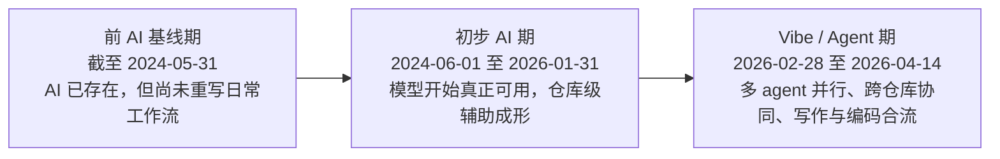
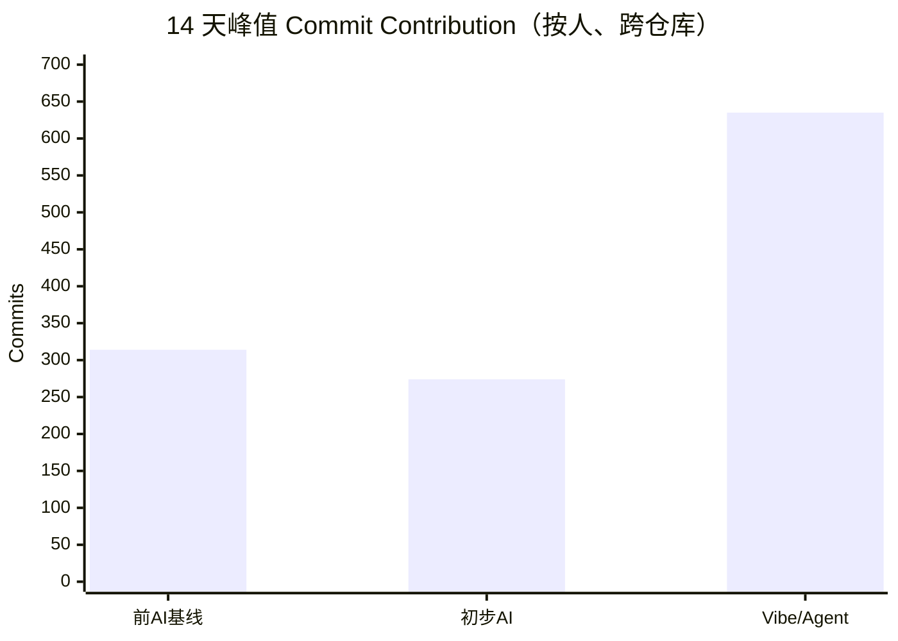
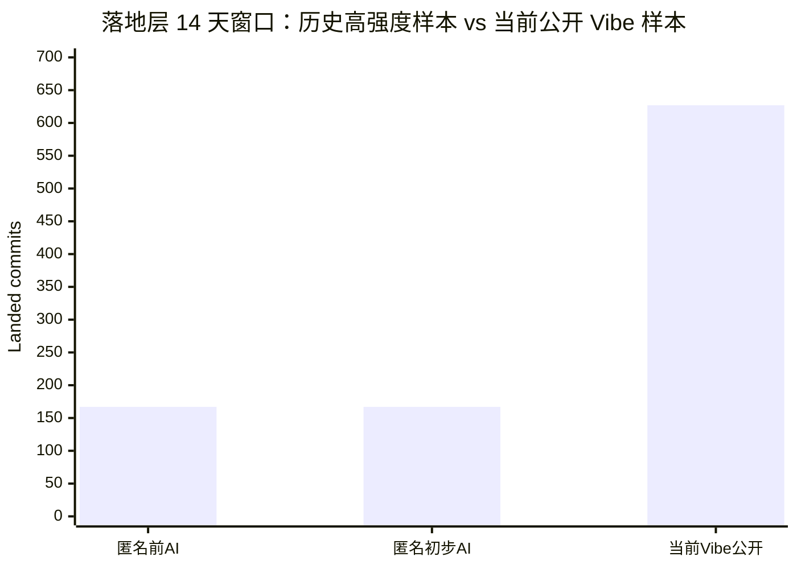
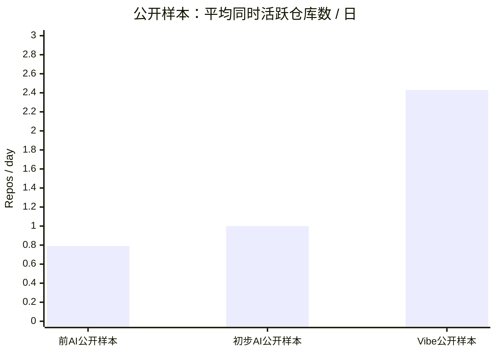

最近这段时间，笔者越来越强烈地意识到一件事：如果今天还把“AI 编程助手”理解成一个躲在 IDE 角落里、偶尔给你补全两行代码的小玩意，那基本已经落后现实半个时代了。

这话不是在故意耸人听闻。真正把人震住的，从来不是“它能不能写两行代码”，而是当模型、agent、上下文工程、仓库级搜索、终端执行和多任务并行这些东西拧在一起之后，人的整个工作单元已经变了。过去你面对的是一个 repo、一段代码、一篇文档、一个 issue；现在你面对的往往是一整条战线，一排同时推进的任务，以及一群嗷嗷待哺、等你继续喂上下文和做裁决的 agent。

换句话说，问题早就不是“AI 能不能写代码”了。问题是：**在写作和编码同时发生的现实工作里，AI 到底把人的产能推到了什么程度，又把人的劳动性质改写成了什么样。**

这篇文章，笔者不想写成那种“AI 真香”“AI 很危险”“拥抱变化”“保持理性”四平八稳的社论。那种东西不是没道理，只是太轻。说白了，很多文章之所以读完像没读，不是因为它们说错了，而是因为它们把一个已经剧烈改写现实的东西，写得像一段平平无奇的行业播报。

所以这次，闲话少叙，笔者准备把事情往硬处写。

一方面，笔者确实去翻了自己的 GitHub 记录。公开部分只用 `HansBug` 这边已经开放的信息做详细统计、详细链接和详细表格；未开源部分则做匿名汇总，不挂仓库名，不挂链接，不做任何可逆去匿名。这不是遮遮掩掩，而是边界就是边界，该公开的彻底公开，不该公开的就到此为止。

另一方面，笔者不准备只盯着某一个 repo 看。你刚进入 vibe/agent 工作流的时候，最容易犯的一个错，就是仍然用“单仓库产能”去理解自己。可现实压根不是这么回事。今天真正离谱的地方，不是某一个 repo 能写多快，而是**同一个人在同一个时间窗里，能同时推进多少条工作面，而且这些工作面还不是同质的**。有的在写代码，有的在补测试，有的在写长文，有的在做路线图，有的在补工程脚手架，有的在修站点。你如果还拿一个 repo 的速度去比，那个坐标系从一开始就是歪的。

因此，这篇文章的主体统计，全都按“人”为单位做。repo 只是拆解维度，不是主体。

## 先把结论拍在桌上

如果你没时间看完整篇，那么先记住下面这几条判断：

1. 笔者自己的 GitHub 记录显示，**当前的 vibe/agent 工作流，确实已经把单位时间内的总产能推到了一个与过去不同量级的水平**。这不是“略有提升”，而是工作单元被彻底重写之后的量变积累成质变。
2. 如果按 GitHub 的 `commit contribution` 口径、以 14 天峰值窗口统计，当前 `2026-04-01` 到 `2026-04-14` 的峰值窗口是 **635**，相对于前 AI 基线期的 **314** 是 **2.02 倍**，相对于初步 AI 期的 **274** 是 **2.32 倍**。
3. 如果只看公开可复核样本、按默认分支落地提交统计，当前 14 天窗口是 **627** 个 landed commit，相对于公开前 AI 窗口的 **60** 是 **10.45 倍**，相对于公开初步 AI 窗口的 **174** 是 **3.60 倍**。
4. 如果把那部分未开源工作做匿名汇总后再看，结论依然没有变温柔：当前公开的 vibe 窗口，单在 landed commit 这一项上，也已经是历史匿名高强度窗口的 **3.75 倍**；若只看非 merge 提交，则是 **3.89 到 4.36 倍**。
5. 最值得注意的，不是“代码 commit 数单项暴涨”，而是**写作、文档、研究笔记、博客站点、框架代码、技能脚手架这些原本分散的输出面，在同一个时间窗里被并行挂起来了**。这才是今天真正离谱的地方。
6. 所以 AI 对人的改变，并不只是“写代码更快了”。它更像是：**把大量低价值、低密度、重复性的手臂动作剔掉了，逼得人把主要时间集中在真正烧脑的判断、架构、路线、边界和裁决上。**
7. 这并没有让人轻松。恰恰相反，它让人的大脑高负荷运转时间密度显著提高。你少做了苦力活，但你多了许多只有你能做、也必须由你负责的决策活。
8. AI 本身不是原罪。垃圾文章和屎山代码不是模型自己凭空长出来的。**AI 的行为，最终仍然应当由人负责。** 工具不会承担品味、判断和责任，承担这些的永远是使用者。

如果只看一句话版结论，那么就是：

> **AI 没有把人从劳动里解放出来；它只是把人从低密度劳动里赶了出来，然后把人扔进了更高密度、更高责任、更高脑力负担的劳动里。**

## 写在分期前面：先把日期钉死，不然这文后面一定吵成一锅

你给出的原始分期里，有一个非常现实的问题：范围是重叠的。

- “前 AI 时代”写的是 `2024 年 6 月之前`
- “初步 AI 时代”写的是 `2024 年 1 月到 2026 年 1 月底`

这两个区间在 `2024-01-01` 到 `2024-05-31` 之间有重叠。写文章的时候可以含糊，做统计的时候不能含糊。否则你后面不管算 commit 数、活跃仓库数还是产能倍数，都会出现同一段时间被重复计入的问题。到那一步，数字再漂亮也没用，因为坐标系本身就是坏的。

因此，**这篇文章采用不重叠的精确分期**：

| 时期 | 精确时间范围 | 为什么这么切 |
| --- | --- | --- |
| 前 AI 基线期 | `截至 2024-05-31` | 把 `2024-05-13` 的 GPT-4o 和 `2024` 年中之后的更成熟代码助手潮作为分界线之前的部分，视为“AI 已存在，但尚未重写日常工作流”的基线期。 |
| 初步 AI 期 | `2024-06-01` 到 `2026-01-31` | 这段时间里，模型开始真正好用，仓库级辅助开始形成，AI 从“能玩”变成“能干活”；但多 agent 编排和大规模 vibe 工作流还没有在笔者自己的工作里彻底爆开。 |
| Vibe / Agent 期 | `2026-02-28` 到 `2026-04-14` | 这里的 `2026-02-28` 是笔者为本文统计采用的**个人工作流分界点**，不是“vibe coding”这个词的诞生日。这个词本身一般被追溯到 `2025-02-02` Andrej Karpathy 的表述；但本文讨论的是工作方式什么时候在笔者这里全面成型，因此采用 `2026-02-28` 作为统计切口。 |

说得更直白一点：**术语的出生日期，不等于你自己的工作方式真正被它改写的日期。** 这两件事不能混为一谈。

下面这张图，是本文采用的分期方式：

这个切法背后的证据链，并不是凭感觉来的，大体有三条：

第一条，是官方产品时间线。`OpenAI` 在 `2024-05-13` 发布 `GPT-4o`，把速度、价格和多模态交互能力一起往前推了一步；`Anthropic` 在 `2025-02-24` 推出 `Claude 3.7 Sonnet`，明确把编码与更强推理结合起来；`OpenAI` 在 `2025-05-16` 公布 `Codex` 研究预览，并在 `2025-10-06` 宣布 `Codex` general availability；`Anthropic` 则在 `2026-03-04` 的公开开发者材料里直接把 `Claude Code` 描述成 “from autocomplete to autonomous agent”。这些节点加起来，已经非常清楚地表明：**行业讨论的对象，早就从“补全”走向“代理型执行”了。**

第二条，是学术与 benchmark 的变化。`SWE-bench` 这类工作把“真实 GitHub issue 能不能被模型解决”抬到了台面上；后来关于 software engineering agents 的综述，则越来越明确地把重点放在 repo-scale reasoning、tool use、issue resolution、workflow orchestration 这些问题上。换句话说，学界和工业界其实在说同一件事：**真正难的不是让模型写一段函数，而是让它在真实工程上下文里持续推进一条工作链。**

第三条，是术语和工作文化的变化。`vibe coding` 这个词一般会追到 `2025-02-02`；但到了 `2025` 年底和 `2026` 年初，公开材料里已经不只是“vibe”这种轻松表述，而是明确出现了 `agentic coding`、`issue-to-PR`、`multi-agent architecture` 之类的组织化工作语言。说白了，这已经不是“边玩边写点小 demo”的范畴了，而是开始进入**一整套 AI 协作生产方式**的范畴。

所以，本文对这三个时期的定义，不是：

- 前面没 AI，后面突然有 AI。

而是：

- 前面 AI 已经存在，但还没真正把整个工作结构改写；
- 中间 AI 开始真正好用，已经能让不少活从手工变成协作；
- 到现在，AI 已经不只是协助工具，而是工作流程里的“部将”和“流水线节点”。

这三个阶段之间真正的差别，根本不在于“有没有模型”，而在于**模型被接进了多大尺度的工作单元**。

## 这篇文章到底怎么统计：不拿一个 repo 硬凑，也不拿一坨行数装懂

先把方法讲明白。

笔者这次做统计，用的是两层口径。

### 第一层：贡献层

这里的指标，是 GitHub `contributionsCollection` 里能拿到的 `commit contribution` 口径。它的作用不是做文件级分析，而是用来回答一个更基础的问题：

> **在某一个连续时间窗里，作为“这个人”，我总共发生了多少次跨仓库的有效提交活动？**

这一层的好处，是它天然适合用来找“高强度窗口”，因为它按人、按天、按仓库都能拆，而且不容易被单个 repo 的个例把视线拖歪。

### 第二层：落地层

这里的指标，是 GitHub REST API 能拿到的默认分支提交详情，包括：

- 落地提交数
- 非 merge 提交数
- 修改文件数
- 增删行
- 涉及语言
- 提交是代码型、文档型还是混合型

这一层的作用，是回答另一个问题：

> **这些高强度工作，最后到底落成了什么样的工程表面？**

换句话说，第一层回答“你到底动了多少”；第二层回答“这些动作最后落下来的是什么”。

### 为什么这两层都要用

因为只看其中一层，都会有坑。

只看贡献层，你会知道“很忙”，但不知道忙出来的是代码、文档、配置、测试还是一堆杂项。

只看落地层，你又容易被默认分支、merge 方式、分支策略和 GitHub API 的技术细节带偏。尤其在今天这种 agent 并行和分支工作流变得很常见的情况下，光看 landed commit，很多“实际上已经发生过的密集劳动”会被压扁。

所以本文的处理方式很简单：

1. **先用贡献层找峰值窗口**；
2. **再用落地层做细粒度分析**；
3. **最后把两者放在一起看**。

### 为什么本文坚持“按人统计”

因为你如果还按 repo 统计，今天的很多变化根本看不见。

以前的高强度输出，往往是“一个主 repo + 一两个配套 repo”；今天的高强度输出，往往是“研究笔记 + 框架代码 + 博客站点 + 技能脚手架 + 调研文档 + 测试与配置”同时发生。你要是还盯着单 repo，那统计出来最多只能说明“这个库最近很活跃”，却说明不了**这个人当前到底处在什么工作状态里**。

说得更难听一点，如果今天还用单仓库产能去理解 vibe/agent 时代的人类劳动，那就跟拿单兵冲锋速度去衡量一个师级指挥调度水平差不多。你当然能测，但你测出来的不是重点。

### 本文如何处理明显“脚本味过重”的样本

这个问题你专门提了，笔者也确实做了处理。

GitHub 上有一类仓库，一看名字、一看提交结构，就知道更像镜像、同步、自动更新、数据回填或者脚本性维护。它们不是没有价值，但如果把它们直接拿来代表“人类高强度思维劳动”，那结论会走样。

所以本文做了两步：

1. 峰值窗口先按人维度从贡献层里筛；
2. 真正展开叙述时，再人工排掉那些明显更像镜像/同步/机械回填的候选窗口，优先保留更能体现“人写的、人在判断的”那一类窗口。

因此，后面你看到的公开样本，不是“所有峰值里随便拎一个最亮的”，而是**峰值里更像真实人工工程输出的那一批**。

### 本文的数据边界

这里必须说清楚，不然很容易被误解：

1. 公开细表和外链，只使用 `HansBug` 这边已经公开的信息。
2. 另一部分未开源工作，笔者确实做了统计，但只做匿名汇总，不挂仓库名，不挂链接，不写任何能把匿名重新逆出来的细节。
3. 所有时间统计的截止时间，是 **2026-04-14**。
4. 行数、文件数这类指标只作为辅助证据，不作为最终 headline KPI。原因很简单：大规模批量更新、资源导入和 GitHub Commit API 的 `300 files` 返回上限，都会让这类数字在某些窗口里膨胀得很难看。它们能说明“表面很大”，但不能直接说明“脑力价值等比增加”。

这一步看似啰嗦，实际上非常关键。因为如果方法不先钉住，后面无论是夸 AI 还是骂 AI，都很容易滑进一种非常省事但非常虚的写法：**拿几个漂亮数字把自己先哄舒服了，然后假装这就是分析。**

这种活，AI 比人还会干。问题是没什么意义。

## 公开样本：`HansBug` 这边能完全复核的三段高强度窗口

先看公开样本的主表。这里的窗口，都是按“人”的维度，在对应时期里挑出的 14 天峰值窗口。

### 表 1：公开样本的 14 天峰值窗口（贡献层，按人、跨仓库）

| 时期 | 时间窗 | 14 天 `commit contribution` | 活跃天数 | 日均贡献提交 | 平均活跃仓库数/日 | 峰值同时活跃仓库数 | 主要公开仓库 |
| --- | --- | ---: | ---: | ---: | ---: | ---: | --- |
| 前 AI 基线期 | `2023-02-22` ~ `2023-03-07` | 117 | 8 | 8.36 | 0.79 | 2 | [opendilab/treevalue](https://github.com/opendilab/treevalue) 101、[HansBug/hbutils](https://github.com/HansBug/hbutils) 9、[HansBug/fake_html](https://github.com/HansBug/fake_html) 7 |
| 初步 AI 期 | `2025-06-13` ~ `2025-06-26` | 264 | 12 | 18.86 | 1.00 | 2 | [HansBug/pyfcstm](https://github.com/HansBug/pyfcstm) 234、[HansBug/plantumlcli](https://github.com/HansBug/plantumlcli) 30 |
| Vibe / Agent 期 | `2026-04-01` ~ `2026-04-14` | 635 | 14 | 45.36 | 2.43 | 4 | [HansBug/research_ideas](https://github.com/HansBug/research_ideas) 328、[HansBug/hubvault](https://github.com/HansBug/hubvault) 139、[HansBug/HansBug.github.io](https://github.com/HansBug/HansBug.github.io) 102、[HansBug/pyfcstm](https://github.com/HansBug/pyfcstm) 46、[HansBug/python-ai-cheatsheet](https://github.com/HansBug/python-ai-cheatsheet) 11、[HansBug/deck-workflow-skill](https://github.com/HansBug/deck-workflow-skill) 7、[HansBug/jml-openjml-field-guide](https://github.com/HansBug/jml-openjml-field-guide) 2 |

先别急着看倍数。光看“工作面”本身，区别已经很明显了。

前 AI 基线期这段公开窗口，本质上还是“一条主线 + 两个边角补位”：主体是 `treevalue` 的维护与修正，旁边挂着 `hbutils` 和 `fake_html`。这很像传统高强度开发时最典型的工作状态：你有一个明确主战场，其他东西是顺手补。

初步 AI 期也差不多，只是主战场更稳定、更厚，集中在 `pyfcstm` 上，旁边带一个 `plantumlcli`。这说明什么？说明 AI 在这时候已经能把**单条主线的推进速度**明显拉起来，但整体工作面仍然相对集中。说得难听一点，这时候的 AI 更像一个相当能打的副官，还不是一整排可以同时带兵冲锋的部将。

到了 `2026-04-01` 到 `2026-04-14` 这个窗口，画风就完全不一样了。

这时候挂起来的不是一个 repo，也不是两个 repo，而是同时出现：

- 研究与写作主仓 `research_ideas`
- 存储框架 `hubvault`
- 博客站 `HansBug.github.io`
- DSL / 框架推进 `pyfcstm`
- 面试速查手册 `python-ai-cheatsheet`
- 技能脚手架 `deck-workflow-skill`
- JML / OpenJML 调研导览 `jml-openjml-field-guide`

这已经不是“一个项目写得很快”了。这是**同一时间窗里，多种类型的输出面同时被挂起来**。

下面这张图，把 14 天峰值窗口的贡献层指标直接放到一起看：

注意，这里柱子的三个数是**按“人”的总峰值窗口**算的，其中前 AI 和初步 AI 的峰值还纳入了匿名未开源样本；而上表只展开公开可复核部分。之所以把两张表放在一起，是为了避免两个常见误区：

1. 只看公开数据，低估你历史上本来就很凶的那部分工作强度；
2. 只看匿名汇总，又把今天公开可核查的证据链抹平。

换句话说，**公开样本负责把事情说实，匿名样本负责不让历史强度被低估。**

### 表 2：公开样本的 14 天峰值窗口（落地层，默认分支 landed commit）

| 时期 | 时间窗 | landed commit | 非 merge commit | 覆盖仓库数 | 修改文件数 | `+` 行 | `-` 行 | 涉及代码提交数 | 涉及文档提交数 |
| --- | --- | ---: | ---: | ---: | ---: | ---: | ---: | ---: | ---: |
| 前 AI 基线期 | `2023-02-22` ~ `2023-03-07` | 60 | 46 | 3 | 256 | 7,580 | 384 | 50 | 22 |
| 初步 AI 期 | `2025-06-13` ~ `2025-06-26` | 174 | 174 | 2 | 537 | 34,142 | 13,283 | 146 | 25 |
| Vibe / Agent 期 | `2026-04-01` ~ `2026-04-14` | 627 | 611 | 7 | 12,158 | 5,727,977 | 149,172 | 158 | 541 |

先解释一下为什么这张表看起来比上一张更夸张。

因为这里统计的是默认分支 landed commit 和文件级结果。它比贡献层更“落地”，也更容易体现当前工作流的批量化和跨仓库 sweep 特征。但它也更容易被大规模批处理、资源导入、文档批量铺开以及 GitHub API 的技术限制影响。因此，这张表更适合用来说明**工作面与落地面**的变化，而不是用来直接宣布“我比过去强了多少倍”。

不过即便如此，它透露出来的信息仍然非常夸张。

首先，`2026` 这个公开窗口已经不是“比过去多干了一点活”，而是**在 14 天里把 7 个公开仓库一起推着走**。哪怕你暂时不看行数，只看 `627` 个 landed commit 和 `611` 个非 merge commit，这个密度也已经说明事情完全不是从前那个节奏了。

其次，当前窗口里，文档相关提交数是 **541**，代码相关提交数是 **158**。这个数字非常关键，因为它说明了一件很多人直觉上反而会忽略的事情：

> **AI 并不是简单地把“写代码”变快了，而是把“原本没空写、懒得写、来不及写、写起来很痛苦的文档与表达面”也一起拉进了日常工作流。**

这点后面还要展开讲，因为它和“写作”这件事息息相关。

### 公开样本的工作形态，到底有什么结构性差别

如果把三个阶段公开样本的结构压缩成一句话，那么大概是这样：

- 前 AI 基线期：**单主线维护**；
- 初步 AI 期：**单主线高速推进**；
- Vibe / Agent 期：**多主线并行推进**。

这三者最关键的不同，不在于“AI 是否存在”，而在于**人是否已经有能力把多个不同性质的任务面，稳定地挂在同一个时间窗里推进**。

这件事在 `2026-04` 的公开窗口里体现得非常赤裸。

你随便扫一眼就知道，这不是一个纯代码窗口。这里面同时有：

- 研究写作
- 博客长文
- 站点改版
- Python 框架开发
- 技术导览
- 技能工具化

过去这几类东西，往往要拆开来做。今天它们可以互相借力。研究笔记能反哺博客长文，博客长文能倒逼站点能力，站点能力能服务内容沉淀，内容沉淀又能反过来补技能脚手架和代码库说明。这就是为什么单仓库视角会把事情看扁：**你真正看到的，已经不是几个孤立项目，而是一张互相供血的生产网。**

这张生产网，才是今天 AI 真正加速的对象。

## 那部分没有开源的工作：结论并没有因此变温柔

上面说的是公开样本。现在来看匿名汇总。

这里先把规矩说一遍：这部分我确实统计了，但只给匿名聚合结果，不挂仓库名，不挂链接，也不写任何可以逆推出具体仓库的细节。不是故作神秘，而是边界本来就该这样。

### 表 3：匿名未开源样本的 14 天高强度窗口（落地层，匿名聚合）

| 匿名样本 | 时间窗 | landed commit | 非 merge commit | 覆盖仓库数 | 活跃天数 | 平均活跃仓库数/日 | 峰值同时活跃仓库数 | 修改文件数 | `+` 行 | `-` 行 |
| --- | --- | ---: | ---: | ---: | ---: | ---: | ---: | ---: | ---: | ---: |
| 匿名前 AI 高强度窗口 | `2023-12-23` ~ `2024-01-05` | 167 | 140 | 8 | 14 | 2.86 | 4 | 1,391 | 51,535 | 5,175 |
| 匿名初步 AI 高强度窗口 | `2024-08-27` ~ `2024-09-09` | 167 | 157 | 6 | 14 | 1.57 | 3 | 644 | 20,560 | 1,461 |

这个表有两个意思。

第一，它说明一个很重要的事实：**笔者在前 AI 和初步 AI 阶段，本来就不是低产的人。** 换句话说，今天的比较，不是拿一个很松垮、很温吞、很低基线的历史自己来衬托现在；相反，历史样本本身就是高强度样本。

第二，它也因此让当前 `2026-04-01` 到 `2026-04-14` 的公开窗口显得更加不讲道理。

因为你把这个匿名历史样本放进来以后，当前公开窗口的 landed commit 仍然是 **627 / 167 = 3.75 倍**；如果只看非 merge 提交，那么当前公开窗口是：

- 相对于匿名前 AI 高强度窗口：`611 / 140 = 4.36 倍`
- 相对于匿名初步 AI 高强度窗口：`611 / 157 = 3.89 倍`

这就很有意思了。

如果你只拿今天的公开窗口去对比一个非常平庸的历史窗口，那么“AI 很强”这句话其实不难说；但当你拿今天去对比的，是**你自己过去那种已经很高压、很密集、而且还是多仓库并行的工作状态**，结论仍然是三倍到四倍这个量级，那事情就不是“主观上感觉快了”，而是真的**连坐标轴都换了**。

更关键的是，这个匿名样本还暴露出一个结构性差异。

### 表 4：匿名历史样本与当前公开样本的“代码/文档触达面”对比

| 样本 | 涉及代码提交数 | 涉及文档提交数 | 观察 |
| --- | ---: | ---: | --- |
| 匿名前 AI 高强度窗口 | 132 | 69 | 编码密度高，文档并不少，但仍是“代码主、文档辅” |
| 匿名初步 AI 高强度窗口 | 160 | 25 | 更典型的“代码主线窗口”，文档面明显收缩 |
| 当前公开 Vibe 窗口 | 158 | 541 | 代码触达面几乎维持历史峰值，但文档触达面直接爆炸 |

这一点非常值得展开。

很多人一看到 AI，会下意识地把问题理解成：“哦，所以你现在代码写得更多了。”

这个理解不能说错，但非常不够。

从这个对比表看，当前公开窗口里的**代码触达提交数**，和历史匿名高强度窗口相比，根本不是简单地十倍八倍那种关系。它相对于匿名前 AI 高强度窗口是 **1.20 倍**，相对于匿名初步 AI 高强度窗口几乎是 **持平**。

真正爆炸的，是**文档与写作面的覆盖**。

当前公开窗口的文档触达提交数：

- 是匿名前 AI 高强度窗口的 **7.84 倍**
- 是匿名初步 AI 高强度窗口的 **21.64 倍**

这个结论太重要了。

它说明今天 AI 最大的威力，不是单纯把“代码 commit 数”抬上去，而是让**代码、文档、研究笔记、博客长文、知识组织**这些过去经常互相挤占时间的东西，开始在同一段高强度工作里一起发生。

说白了，AI 的离谱之处，不是把单条生产线转得更快，而是让原本分散的几条生产线开始同时运转。

而这，才是真正把人的工作方式掀翻的地方。

## 把“感觉离谱”翻成数字：这几个倍数，才是本文真正要说的话

到这里，结论已经可以很清楚地写出来了。

### 表 5：按人、跨仓库的峰值窗口倍率（贡献层，保守口径）

| 时间窗 | 前 AI 基线期 | 初步 AI 期 | Vibe / Agent 期 | `Vibe / 前AI` | `Vibe / 初步AI` |
| --- | ---: | ---: | ---: | ---: | ---: |
| 7 天峰值 | 193 | 184 | 395 | 2.05x | 2.15x |
| 14 天峰值 | 314 | 274 | 635 | 2.02x | 2.32x |
| 30 天峰值 | 580 | 459 | 996 | 1.72x | 2.17x |

这个表用的是比较保守的口径，也就是 GitHub contribution-layer 的按人峰值窗口。

你会发现一个有意思的现象：如果只看这层口径，今天的增长非常扎实，但并没有夸张到离谱得像神话。它大体落在 **1.7 倍到 2.3 倍** 之间。

这很有价值，因为它提醒我们一件事：**不要为了证明 AI 很强，就拿最激进的指标去喊口号。**

如果用最保守、最克制的口径看，今天的 Vibe / Agent 期依然稳定地是历史高强度窗口的两倍上下。这个数字已经足够说明问题，而且相对稳。

但如果只停在这里，又会丢失另一半现实。

### 表 6：公开与匿名样本的落地层倍率（更贴近“干成了多少事”）

| 对比口径 | 基线窗口 | 当前 Vibe 公开窗口 | 倍率 |
| --- | --- | ---: | ---: |
| 公开 landed commit | 前 AI 公开窗口 60 | 627 | 10.45x |
| 公开 landed commit | 初步 AI 公开窗口 174 | 627 | 3.60x |
| 公开非 merge commit | 前 AI 公开窗口 46 | 611 | 13.28x |
| 公开非 merge commit | 初步 AI 公开窗口 174 | 611 | 3.51x |
| 匿名 landed commit | 匿名前 AI 高强度窗口 167 | 627 | 3.75x |
| 匿名 landed commit | 匿名初步 AI 高强度窗口 167 | 627 | 3.75x |
| 匿名非 merge commit | 匿名前 AI 高强度窗口 140 | 611 | 4.36x |
| 匿名非 merge commit | 匿名初步 AI 高强度窗口 157 | 611 | 3.89x |

如果说上一张表说明的是“总体强度确实翻倍了”，那么这张表说明的就是：

> **当工作流真正进入多 agent、多仓库、多输出面的状态以后，最终落到默认分支上的东西，已经是过去高强度窗口的 3 到 4 倍，某些公开对比甚至可以到 10 倍以上。**

笔者为什么没有直接把 `10.45x` 当 headline 写在开头？因为那样虽然很炸，但不够稳。公开前 AI 窗口本身偏窄，结构也偏集中，拿它当唯一基线很容易显得在挑软柿子捏。

所以更稳妥的 headline，应该是：

1. 用 contribution-layer 看，当前人级峰值窗口，大致是历史高强度窗口的 **2 倍左右**；
2. 用 landed-layer 看，当前公开窗口，相对于历史匿名高强度窗口，已经达到了 **3.75 倍到 4.36 倍**；
3. 真正“离谱”的地方，不只是代码，而是**代码和写作一起被推到了高并行状态**。

这三句合在一起，才是比较完整的结论。

### 一张图看完倍率关系

如果非要我把这段统计压缩成一句很俗、但又确实准确的话，那就是：

**AI 真正厉害的地方，不是给你省几次敲键盘，而是把你原来分三周、分三条线、分三种心境才能做完的东西，硬生生压进同一个 14 天窗口里。**

这就是为什么体验层面会觉得“离谱”。

## 为什么我说今天最大的变化不是“代码更多”，而是“总工作面暴涨”

这个判断必须单独拎出来讲，因为它几乎决定了你如何理解今天的 AI。

很多人会本能地把 AI 的价值理解成：

- 原来一天写 500 行代码，现在一天写 1000 行；
- 原来三小时做完一件事，现在一小时做完；
- 原来一个 repo 一周推进 10 个 commit，现在推进 30 个。

这些理解都不能说错，但它们有一个共同的问题：**仍然停留在“单任务加速”这套旧坐标系里。**

可今天的现实，更像这样：

- 原来你会在“先写代码还是先补文档”之间犹豫；
- 现在代码和文档可以一起推进。
- 原来你会在“先做框架还是先写长文”之间做取舍；
- 现在框架推进、长文沉淀、博客站点和研究笔记可以互相供血。
- 原来你处理一个任务时，另一个任务大概率就得排队；
- 现在你可以让多个 agent 分头施工，而你自己主要盯边界、接口、优先级和裁决点。

这背后不是简单的“更快”，而是**工作排程方式被改写了**。

从公开 Vibe 窗口来看，`2026-04-01` 到 `2026-04-14` 的平均活跃公开仓库数已经达到 **2.43 个/日**，峰值同时活跃公开仓库数达到 **4 个/日**。这还只是公开样本，不含那部分未开源工作。

对应的前 AI 公开窗口呢？

- 平均活跃公开仓库数/日：**0.79**
- 峰值同时活跃公开仓库数：**2**

初步 AI 公开窗口也只有：

- 平均活跃公开仓库数/日：**1.00**
- 峰值同时活跃公开仓库数：**2**

换句话说，**公开可见层面上，今天的工作并行度已经是过去的 2 到 3 倍**。

下面这张图把这件事画得更直观：

这张图其实比很多“代码写了多少行”的图更能说明问题。

因为它揭示的是：**你的大脑不再只是沿着一条轨道跑，而是在同一时间里盯着更多轨道。**

说得再白一点，今天的 AI 真正厉害的地方不是让一个人“更像程序员”，而是让一个人越来越像一个**在多个任务面之间持续调度的系统管理员、技术主编、架构裁判和小型指挥官**。

这不是修辞，这是工作现实。

## 于是，人为什么反而更累了

很多外行看到这里，会很自然地问一句：

> 既然效率提高了这么多，那你不是应该更轻松吗？

不好意思，恰恰相反。

这事真正反直觉的地方就在这里：**AI 越能干，人在很多时候反而越累。**

原因并不复杂。

过去很多时间，其实浪费在低密度劳动上。比如：

- 机械搬运
- 重复改名
- 样板代码
- 文档格式整理
- 搜路径
- 补一些没什么技术含量但很费手的胶水
- 低级试错
- 需要耐心但不太需要判断的重复操作

这些活以前都得你自己做。它们不一定很难，但很碎，很耗，很打断心流。你写一天代码，不一定有多少时间是真正在做高密度判断，很多时候只是在和这些琐碎动作拉扯。

现在好了，AI 把这类活吃掉了一大块，甚至不少时候吃得比你还好。

于是问题来了：

**既然“不用动脑的苦力活”都被剥走了，那么最后留在你面前的，还能是什么？**

当然只剩那些真正烧脑的东西。

比如：

- 需求边界到底怎么切
- 这几条任务线谁优先
- 哪个 agent 该先放出去
- 谁在改什么，接口会不会撞
- 哪些地方必须人亲自过脑
- 哪些内容虽然能生成，但还没到能签字负责的程度
- 哪个判断属于“看起来能跑”，哪个判断属于“长期站得住”
- 今天这一轮到底是在堆垃圾，还是在真正推进体系

也就是说，人并没有不干活，只是**越来越只干那些最费脑子的活**。

这就像什么呢？

过去的你，更像在前线战壕里打仗的士兵，最多算个尖刀排排长。你当然很累，但累里面掺着不少体力活、操作活和局部火力点处理。

现在不一样了。现在的感觉，更像是你坐在帅案前，盯着沙盘，看着一堆部将来回报情况：

- 这条线推进到了哪
- 那个仓库卡在什么地方
- 这个 agent 需要补上下文
- 那个 agent 需要立刻打断
- 这边的博客文章要不要上图
- 那边的库是不是该先把接口钉死
- 哪个任务今天必须收口
- 哪个任务可以明天再打

你整个人的工作状态，越来越像在“调兵遣将”。

而调兵遣将这种事，看起来不怎么抡锤子，实际最耗命。

说到底，过去让你累的，很多是琐碎；现在让你累的，很多是持续不断的高密度决策。前者像搬砖，后者像一直在下棋，而且棋盘还不止一张。

所以笔者最近越来越能理解“劳心”这两个字。

有时候真会生出一种很荒唐、但又很诚实的感慨：以前读史的时候，总觉得诸葛丞相那些“夙夜忧叹”“鞠躬尽瘁”多少带点文学修辞；现在稍微理解一点这种高密度统筹工作的状态以后，才会发现，这玩意真不是文人拿来煽情的。它是真的耗人。

说白了，**AI 把你从琐碎中解放出来了，但它没有把你从疲惫中解放出来。它只是把疲惫的来源，从手脚，换到了脑子。**

这两种累，不是一回事。

## 这件事逼着人成长了什么：不是“更会用工具”，而是被迫换了视角

如果事情只到“更累”这一步，那也太亏了。

幸好不是。

AI 这套工作方式，除了把人压得很紧之外，也确实逼着人长出了一些过去不容易长出来的东西。

### 第一件事：它几乎是半强迫地打破了人的敝帚自珍

这点其实很残酷，但也很有价值。

以前很多程序员会天然地把价值感绑在一些非常表层的东西上，比如：

- 我手写得很快
- 我背的 API 多
- 我模板熟
- 我样板代码抄得顺
- 我某些重复套路比别人更熟练

这些东西以前当然有用，甚至一度还挺能打。但 AI 一上来，最先碾过去的恰恰就是这一层。

于是人会被迫面对一个极其不舒服、但绕不过去的问题：

> **如果这些我曾经引以为傲的表层熟练度，AI 现在也能做，甚至还能做得更快，那我身上真正不可替代的部分到底是什么？**

笔者自己的答案越来越明确：

1. 创造力
2. 对问题本质的把握
3. 对领域的深度理解
4. 对边界、代价和长期后果的判断
5. 对“什么叫真的成立”的品味

换句话说，人真正值钱的地方，不是“你会不会写那个 for 循环”，而是**你知不知道这个循环到底该不该存在，它应该服务哪条主线，它写成这样将来会不会害人，它背后的抽象是否站得住。**

这才是最后值钱的东西。

AI 把这一点几乎是强行摊在了人面前。你躲都躲不掉。

### 第二件事：它迫使人获得更高的视角

这点和前一条是连着的。

过去很多时候，你可以长期沉浸在局部实现里，因为大量时间确实都花在局部实现上。你每天面对的是“这个函数怎么写”“这个类怎么拆”“这个脚本怎么跑通”。

现在当多个 agent 同时开工之后，你的注意力天然就会被抬高。

为什么？

因为将帅没工夫天天盯着一个碉堡怎么炸。他当然要关心碉堡，但他不可能只关心碉堡。他真正要盯的是：

- 战线是不是在推进
- 哪个方向是主攻
- 哪个方向只是佯攻
- 兵力分配是否合理
- 补给线有没有断
- 哪个点一旦失守会拖垮全局

映射回工程工作，其实就是：

- 哪些任务是主线，哪些只是噪音
- 哪些接口一定要先定，哪些可以晚一点
- 哪些 agent 该放出去，哪些还得你自己下场
- 哪些内容必须先收敛判断再动手，哪些可以先铺再收
- 哪个 repo 今天一定要交代清楚，哪个 repo 可以先挂着

这会把人从“局部实现视角”强行拉到“战线视角”。

这不是因为人突然变高级了，而是因为**不站高一点根本管不过来**。

### 第三件事：它逼着人学会多线程工作

这个点，笔者自己感受尤其深。

过去我其实并不是一个天然擅长多线程工作的人。更准确地说，我以前的思维惯性有点偏线性。做事时我很容易一头扎进一个问题里，把它狠狠干到底。这个习惯本身不坏，很多时候甚至是优点，但它有一个副作用：**不够适合今天这种同时和多个 agent、多个 repo、多个上下文打交道的工作形态。**

而现在，这种工作形态根本不允许你继续保持纯线性。

你必须学会：

- 在几个上下文之间快速切换
- 记住不同任务当前分别推进到哪里
- 知道哪个任务是在等待输入，哪个任务是在等待验证
- 在脑子里维护多个“半打开”的问题空间
- 不让自己因为上下文切换太频繁而彻底丢线

说白了，就是要学会眼观六路、耳听八方。

这套能力以前当然也有价值，但不是每天都被逼到墙角。现在不一样。现在你如果学不会，根本带不动这套工作流。

这也是为什么笔者会说，今天这种 agent 工作方式，本质上已经不再只是“编程”或者“写作”的问题，而是越来越像一种**高密度信息调度与任务编排能力**。

你不一定喜欢它，但你如果想把效率吃满，就必须会。

## 说回写作：AI 为什么会把“文档面”和“博客面”也一起点燃

很多人谈 AI coding，眼睛只盯代码。这其实很可惜。

因为从笔者自己的统计看，今天真正被点燃的，不只是代码面，还有写作面。

前面已经给过数字了，当前公开 Vibe 窗口的文档触达提交数是 **541**。这个数不是装饰，它说明了一件很根本的事：

**写作已经不再是工程工作之外的副产物，而开始重新进入主流程。**

这点为什么重要？

因为过去很多“应该写下来”的东西，最后都没写。

不是因为人不知道该写，而是因为：

- 没空
- 太费劲
- 一写就要切心流
- 写的时候得重新组织表达
- 资料在脑子里有，但要落成可读文本太麻烦

结果就是，很多本来应该沉淀成知识资产的东西，最后都烂在聊天记录、临时草稿、issue 评论和脑补里。

这其实一直是工程工作里很顽固的一种浪费。表面上看，好像系统跑起来了；实际上很多真正有价值的经验根本没有被沉淀，项目一换、人一走、上下文一断，前面踩过的坑又要重新踩一遍。

AI 在这里最狠的一刀，不是替你“写得更漂亮”，而是把把这些沉淀动作的门槛大幅拉低了。

于是会发生什么？

会发生这样的事情：

- 研究笔记开始能快速铺开
- 调研综述更容易先成形，再回头收束
- 博客长文不再只能等“有整块空闲时间”才写
- 项目路线、知识图谱、字段说明、文档摘要，都更容易被持续更新
- 站点本身也更容易跟着内容迭代，而不是永远停在一个“以后再做”的半成品状态

如果说过去的你，经常要在“写代码”和“写下来”之间二选一，那么今天越来越多的时候，你可以让它们串起来：

- 代码在推进；
- 文档也在跟；
- 博客在沉淀；
- 站点在承接；
- 思考在回流。

这件事一旦跑通，人对“知识管理”和“技术写作”的态度都会变。

以前很多人把写作理解成一种额外负担，像是工作都做完了以后，才有资格去做的锦上添花。

现在不是了。

现在越来越像是：**你不写，你反而吃亏。**

因为 AI 已经把“把经验快速整理成结构化文本”的成本砍下来了。你这时候还不写，很多宝贵的判断就只能继续烂在脑子里，或者烂在上下文窗口里。那才是真正的浪费。

所以笔者今天对“写作”这件事的看法，和以前相比已经明显变了。

它不再是“我有余力时再做的表达性活动”，而越来越像工程工作本身的一部分。不是附庸，不是装点门面，也不是写给别人看的自我展示，而是**把判断、经验、结构和路线正式固化下来的动作**。

这也正是为什么，笔者会毫不犹豫地把 AI 用在博客和写作上。

因为在今天，**不把 AI 用在写作上，本身反而是在浪费一种极其宝贵的知识外化能力。**

## 说回代码：AI coding 的威力到底“离谱”在什么地方

说了这么多写作，再把视角收回代码本身。

笔者觉得，今天 AI coding 的离谱之处，至少有四层。

### 第一层：它能把大量低价值实现动作吞掉

这层其实大家都知道，就不展开重复了。样板、胶水、搬运、格式、常规重构、重复测试、路径搜索、局部改名、文档框架、简单脚手架，这些东西现在都已经大量可以外包给模型或 agent。

但这层，只能算地板，不是天花板。

### 第二层：它能显著降低多仓库切换的心理成本

这点反而经常被低估。

以前人在多仓库切换时，最大的损耗往往不是“不会写”，而是：

- 重新进上下文
- 重新找入口
- 重新看结构
- 重新恢复工作记忆

而这些事情，其实非常耗神。

今天有了 repo-aware 的搜索、上下文压缩、agent 摘要、批量 diff 解释之后，多仓库切换虽然仍然很累，但它不再像以前那样“每切一次都像重新投胎”。

于是很多过去会被你主动回避的切换，现在变得可以接受。工作面自然就能展开得更宽。

### 第三层：它把很多原本需要“整块空档”的任务，打碎成了可以穿插推进的任务

比如以前写一篇长文，很多人都得等状态、等时间、等整块空档。现在不一样。你可以先把结构立起来，让 AI 帮你把已知事实、表格、数据、引用先铺好，再由你自己一层层把判断钉进去。

写代码也是一样。过去某些系统性整理动作，比如统一接口、全局重命名、补文档、补说明、整理测试，往往要等你“专门抽一段时间”才能做。现在你可以把它拆开来，穿插进主任务之间。

这就意味着，许多任务不必再排队等死。

### 第四层：它让“架构意图”和“工程表面”之间的距离变短了

这才是今天真正让我觉得离谱的一层。

过去人脑子里常常会有一个相对完整的想法，但这个想法要真正落成一组工程改动，中间隔着很多摩擦：

- 你要自己把局部细节一层层展开
- 你要自己照顾很多重复结构
- 你要自己把不同文件里的机械性同步做完
- 你要自己把说明和代码一并补齐

于是，很多本来脑子里很清楚的好想法，最后不是做不出来，而是被这堆摩擦磨死了。

现在这种情况大幅缓解了。

于是人的工作重心就会前移。你会越来越把主要精力花在：

- 这个抽象是否成立
- 这条路线是否合理
- 这个系统边界是否清楚
- 这件事该不该做
- 应该怎么组织，而不是只是怎么敲出来

这也是为什么我会说，AI coding 真正可怕的地方，不是它替你写了多少行，而是它让**想法通往工程表面的通路变宽了**。

一旦这条通路变宽，很多过去本来“有价值但懒得做、来不及做、做不动”的东西，今天都可能被捞出来真正做掉。

这玩意当然离谱。

## 但请注意：不要拿“行数”当作最终 KPI，那是最容易把自己骗舒服的东西

这里必须泼一盆冷水，不然这文就容易写飘。

当前公开 Vibe 窗口里，行数相关指标看起来极其夸张，甚至已经到了肉眼可见不正常的程度。比如：

- `research_ideas` 里出现了多次接近或达到 GitHub Commit API `300 files` 返回上限的大提交；
- `HansBug.github.io` 里也出现了文件数直接顶到 `300` 的批量改动；
- 这类提交会把增删行和文件数瞬间顶得很高。

这说明什么？

说明今天的工作流确实已经能支撑**大规模 sweep 式更新**。这本身就是新现象。

但它同样说明：如果你把“行数”直接当成 headline KPI，那就非常容易自欺欺人。因为：

1. 大规模数据/资源/文档批处理会显著放大行数；
2. 批量重排、生成性内容和结构性导入，会让“行数”膨胀得很好看；
3. GitHub API 本身还有 `300 files` 这样的技术上限，说明某些提交已经大到指标开始变形。

所以笔者在这篇文章里，刻意把行数放到了辅助证据的位置。

它能说明今天的工作表面很大、批量 sweeping 很常见、AI 确实让很多大面更新变得可行；但它不能单独说明“人今天的价值提升了多少”。

因为说到底，**人的价值不在行数里，而在判断里。**

这一点如果丢了，文章哪怕数据再多，也会写成一种非常廉价的“产能崇拜”。

那就不好看了。

## 我对 AI 产物的态度：别把责任甩给工具，真正该背锅的是人

聊到这一步，就得把态度摆明。

笔者对 AI 产物的看法很直接：

**AI 本身不是原罪。**

如果 AI 生成出一篇又一篇垃圾文章，或者写出一坨又一坨屎山，在我看来，单纯去怪 AI 本身，意义并不大。你当然可以骂模型不稳定、会胡说、会瞎写，会一本正经地胡扯，但说到底，真正应该负责的，还是使用它的人。

因为工具不负责目标，工具不负责品味，工具不负责边界，工具更不负责签字。

负责这些事情的，永远是人。

这就像什么呢？

同样是带兵，有的人能把一群人组织成一支军队；有的人一江无能，累死千军，到头来还怪千军没本事。你说到底该怪谁？

怪兵器有时候当然也能怪，但如果主帅自己脑子一团浆糊，那他就算手里拿的是神兵利器，也照样能把仗打成笑话。

AI 也是一样。

一个真正懂行的人，会怎么用 AI？

他不会把判断权交出去，而是会：

- 先把问题定义清楚
- 把评价坐标钉住
- 把边界交代清楚
- 把真正关键的地方亲自盯住
- 让 AI 去跑那些机械性、重复性、可批量化的部分
- 再用自己的领域知识和审美把结果收回来

一个糊涂的人，则会怎么用 AI？

- 问题没定义清楚就开始生成
- 自己没有判断，只会接受第一版结果
- 不做复核
- 不管边界
- 不对后果负责
- 最后生成一堆垃圾，再怪 AI 不靠谱

这两种人用的是同一个工具，出来的东西当然会是两个世界。

所以我今天对这件事的态度非常明确：

> **AI 会不会把流程做坏，最终决定因素依然是人。**

这个结论在今天没有变，将来也不会轻易变。

## 这件事我不避讳：我的代码和这座博客，我就是会用 AI 来写

既然态度都摆到这里了，那索性把话说透。

是的，笔者今天写代码会用 AI。

是的，笔者今天写博客也会用 AI。

而且这不是什么偷偷摸摸、遮遮掩掩、非得藏在桌底下完成的事。相反，我觉得这件事本来就没必要装。

如果 AI 在今天已经是现实生产工具，而你又真的在用它，那最虚伪的姿态反而是嘴上装得很古典，实际早就全程离不开。

这没什么意思。

更进一步地说，笔者甚至会主动把自己过去的写作风格、句法习惯、论证方式、标题结构和文章气口，蒸馏进今天的写作流程里。因为我真正想保留的，不是“每个字必须是我自己手敲”，而是：

- 文章里的判断是我的
- 文章里的立场是我的
- 文章里的问题定义是我的
- 文章里的边界意识是我的
- 文章里最终拍板的那一下，还是我的

AI 在这里的角色，不是替我成为作者，而是把我的想法更快地压到可见表面上。

只要最后出来的内容，确实是我所思所想，而且我愿意为它负责，那这件事在我这里就是成立的。

所以如果你介意的是“有没有 AI 参与”本身，那我们大概本来也不是同一路读者。你关掉页面，双方都轻松。

但如果你真正关心的是：

- 这篇文章有没有判断
- 这些判断是不是站得住
- 作者是否愿意对内容负责
- 文字背后是不是有真实经验和真实分析

那么在我看来，问题的重点从来不在“有没有 AI”，而在**最后站在文本背后签字的人是谁**。

笔者对此的态度很简单：

**我会负责。**

我不会把锅甩给模型。

我会看，会改，会判断，会删，会压，会重写，会把不属于我的东西扔掉，会把真正属于我的东西钉死。

这才是我认为今天使用 AI 的正确姿势。

## 再往深里说一层：今天真正稀缺的，不是写代码的手，而是承担判断的脑

写到这里，这篇文章其实已经可以收束了。

但我还想再往上抬半层。

因为如果我们只停在“AI 让人更高效”，那这个结论还是太扁。

归根结底，今天 AI 对人的最大冲击，不是让人少学一点语法，也不是让人少写一点样板，而是逼着人重新回答一个非常根本的问题：

> **在一个越来越多工程表面都可以被模型和 agent 生成、修改、重写、扩展的时代，人真正不可替代的部分到底是什么？**

我越来越觉得，答案不复杂，但也不轻松。

真正不可替代的，不是“我会不会写这段代码”，而是：

- 我有没有能力定义真正的问题
- 我有没有能力区分表象和本质
- 我有没有能力判断什么是成立的、什么只是能跑
- 我有没有能力给系统画出一条正确的演化线
- 我有没有能力在海量可能性里做出克制且负责的取舍
- 我有没有能力对结果签字，而不是只对过程找借口

这些东西，才是最后值钱的。

说得再狠一点，AI 时代真正被抬价的，不是执行力本身，而是**有方向的执行力背后的判断权**。

谁能定义方向，谁能承担判断，谁就还是核心。

谁如果只会在旧世界里珍藏那些“我很熟练地亲手完成了某些重复动作”的成就感，那很遗憾，这种价值会越来越快地被冲刷掉。

这话听起来有点冷，但我觉得它是事实。

也正因为如此，AI 时代虽然把很多旧技能贬值了，却并不意味着“人没价值了”。恰恰相反，它是把人的价值重新逼回到更高、更硬、更难伪装的地方。

以前你还可以靠勤奋掩盖判断不足，靠体力掩盖结构感不足，靠手速掩盖问题定义能力不足。

现在越来越不行了。

因为那些“只要肯花时间就能补上的部分”，AI 吃得太快了。

最后留下来的，只能是那些**AI 不替你承担、也永远不能替你签字的部分**。

那一部分，才是人的真正重心。

## 总结：AI 不是替人思考，它只是把低价值的手臂动作从战场上撬走了

现在回头看，这篇文章其实就想说明一件事。

AI 之于写作和编码，绝不是“多了一个方便的小工具”这么轻飘飘的事。

它真正改写的，是：

- 工作单元
- 并行度
- 产能上限
- 文档与代码的关系
- 人的认知负载分布
- 人对自己价值的理解

从数据上看，当前的 Vibe / Agent 工作流，已经把笔者按人、跨仓库统计的高强度窗口，稳定推到了历史高强度窗口的 **2 倍左右**；如果只看更贴近最终落地结果的样本，则已经达到了 **3 到 4 倍** 乃至更高。

但更重要的是，今天被推高的不是“某一个 repo 的手速”，而是**多条战线同时推进的能力**。

过去的我，更像战壕里的士兵，顶多算尖刀排排长；今天的我，越来越像坐在帅案前调度部将的人。电脑和办公桌，已经有点像沙盘和帅案；一群等待继续喂上下文、继续领任务、继续被裁决优先级的 AI agent，也确实越来越像一支随时待命的部伍。

这当然很爽。

但也当然很累。

因为从前你是自己冲锋，现在你要负责让一整条线不乱；从前你多半只盯一个局部，现在你要盯多个上下文、多条主线和多种产物；从前你有很多体力活，现在你留下来的大半都是脑力活。

说到底，这不是“工作消失了”，而是**工作的重心上移了**。

AI 没有替人活。

它只是把大量低价值的手臂动作，从战场上撬走了。

而人，被迫从战壕里抬起头，坐到帅案前，开始真正面对那些过去可以暂时不面对的东西：

- 判断
- 方向
- 品味
- 边界
- 责任

这未必轻松，甚至很可能更累。

但如果非要问我，对这件事最后的态度是什么，那我的回答还是很明确：

**这不是坏事。**

因为归根结底，人真正该值钱的，本来也不是手抡得多快，而是脑子到底在想什么，眼睛到底看多远，最后敢不敢为自己的判断负责。

至于 AI —— 让它干活去吧。

它本来就该干活。

真正不能偷懒的，从来不是它。

而是坐在帅案前、最后要签字的那个人。

## 参考资料

1. OpenAI, “Hello GPT-4o”, `2024-05-13`：<https://openai.com/index/hello-gpt-4o/>
2. Anthropic, `Claude Code` 相关公开材料与发布记录，含 “How Claude Code went from autocomplete to autonomous agent”, `2026-03-04`：<https://www.anthropic.com/customers/how-anthropic-teams-use-claude-code>
3. Anthropic, 平台发布说明，含 `Claude Sonnet 3.7`、`Claude Sonnet 4.6` 等记录：<https://docs.anthropic.com/en/release-notes/api>
4. Anthropic, 平台发布说明（system prompts / feature timeline），`2026` 年持续更新：<https://docs.anthropic.com/en/release-notes/system-prompts>
5. OpenAI, “Introducing Codex”, `2025-05-16`：<https://openai.com/index/introducing-codex/>
6. OpenAI, “Codex is now generally available”, `2025-10-06`：<https://openai.com/index/codex-generally-available/>
7. Anthropic, “2026 Agentic Coding Trends Report” PDF：<https://resources.anthropic.com/hubfs/2026%20Agentic%20Coding%20Trends%20Report.pdf>
8. Jimenez et al., “SWE-bench: Can Language Models Resolve Real-World GitHub Issues?”, `2024`：<https://arxiv.org/abs/2310.06770>
9. Wang et al., “A Survey of Software Engineering Agents”, `2024`：<https://arxiv.org/abs/2409.02977>
10. “How early adopters are reshaping software development with GenAI”, `2025`：<https://arxiv.org/abs/2503.05012>
11. Know Your Meme 对 `vibe coding` 词源脉络的整理，指出该词通常追溯到 `2025-02-02` 的相关表述：<https://knowyourmeme.com/photos/3029670-vibe-coding>
12. 公开仓库样本：
    - <https://github.com/opendilab/treevalue>
    - <https://github.com/HansBug/hbutils>
    - <https://github.com/HansBug/fake_html>
    - <https://github.com/HansBug/pyfcstm>
    - <https://github.com/HansBug/plantumlcli>
    - <https://github.com/HansBug/research_ideas>
    - <https://github.com/HansBug/hubvault>
    - <https://github.com/HansBug/HansBug.github.io>
    - <https://github.com/HansBug/python-ai-cheatsheet>
    - <https://github.com/HansBug/deck-workflow-skill>
    - <https://github.com/HansBug/jml-openjml-field-guide>
